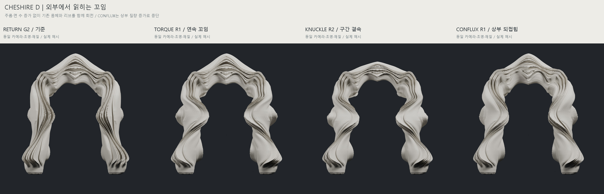

# CHESHIRE — D / RETURN external articulation

2026-10-11 · Cycle 01 · 실제 메시 디자인 개발 완료

**TORQUE R1을 우선 추천하고 KNUCKLE R2를 독립적인 비교안으로 보존한다.** RETURN의 컨셉을 유지하면서 기존 몸체와 플루팅을 함께 회전시켰다. 정면뿐 아니라 측면·후면에서도 리브의 방향 전환이 읽힌다. 최종 미적 선택은 확정하지 않았다.

## 결과와 판단

| 후보 | 출발 자산 | 얻은 것 | 잃은 것·남은 문제 | 판단 |
|---|---|---|---|---|
| TORQUE R1 | RETURN G2 실제 메시 | 하부 감김 → 중간 역방향 회전 → 어깨로 펴지는 연속 흐름. 외부 실루엣과 측면에서 꼬임이 강하게 드러남 | 일부 개구부 폭 감소. 원래 중앙 상부의 무거운 V자 결속과 넓은 조용한 면은 남음 | 우선 추천, 최종안 아님 |
| KNUCKLE R2 | RETURN에서 분기한 INFLECT G4 실제 메시 | 팽창·결속과 방향 전환의 구간 차이. R1의 과대한 몸통 팽창을 줄이고 결속을 길게 연결 | R1의 공격적인 돌출 감소. 마디의 존재가 TORQUE보다 강함. 낮은 상부는 INFLECT에서 물려받은 특징 | 독립 비교안 |
| CONFLUX R1 | RETURN G2 실제 메시 | 기둥 회전이 어깨와 상부 되접힘으로 이어짐 | 중앙 깊이 3.34 → 3.71, V자 입술과 두꺼운 처마가 더 강해짐 | 기하 통과, 조형적 손실로 후속 개발 중단 |

세 방향에서 총 **네 개의 실제 메시**를 생성했다. KNUCKLE만 R1 렌더를 검토한 뒤 R2로 수정했다. 다른 두 방향은 의미 없는 세대 증가 없이 R1에서 멈췄다. 새 기술적 실패는 없었으며 CONFLUX의 중단과 KNUCKLE R1의 수정은 조형적 판단이다. 과거 교차 실패를 이번 성공으로 바꾸어 기록하지 않았다.

독립된 마디를 추가하거나 적층하지 않았다. 기존 리브의 위치와 몸체가 함께 돌아가며 팽창과 결속을 만든다. TORQUE는 복잡한 부분들이 하나의 건축적 흐름에 종속된다는 점에서 가장 설득력 있다. KNUCKLE은 구간 차이가 더 분명하지만 반복된 덩어리로 읽힐 위험을 완전히 없애지는 못했다.

## 같은 카메라의 실제 메시 비교

[정면·사선·측면 전체 비교](docs/overnight_20261011/cycle_01/images/02_three_views.jpg) · [측면·후면 회전 흐름](docs/overnight_20261011/cycle_01/images/03_rotation_flow.jpg) · [KNUCKLE 주요 세대 변화](docs/overnight_20261011/cycle_01/images/04_knuckle_generations.jpg) · [중간 규모 상세](docs/overnight_20261011/cycle_01/images/05_meso_comparison.jpg) · [35mm 원근 접근 비교](docs/overnight_20261011/cycle_01/images/06_passage_comparison.jpg) · [실제 수평 단면](docs/overnight_20261011/cycle_01/images/08_actual_sections.jpg)

| 실제 렌더 | 정면 | 사선 | 측면 | 후면 |
|---|---|---|---|---|
| RETURN G2 | [보기](docs/overnight_20261011/cycle_01/images/RETURN_G2/front.jpg) | [보기](docs/overnight_20261011/cycle_01/images/RETURN_G2/oblique.jpg) | [보기](docs/overnight_20261011/cycle_01/images/RETURN_G2/side.jpg) | [보기](docs/overnight_20261011/cycle_01/images/RETURN_G2/rear.jpg) |
| TORQUE R1 | [보기](docs/overnight_20261011/cycle_01/images/D_TORQUE/front.jpg) | [보기](docs/overnight_20261011/cycle_01/images/D_TORQUE/oblique.jpg) | [보기](docs/overnight_20261011/cycle_01/images/D_TORQUE/side.jpg) | [보기](docs/overnight_20261011/cycle_01/images/D_TORQUE/rear.jpg) |
| KNUCKLE R2 | [보기](docs/overnight_20261011/cycle_01/images/D_KNUCKLE/front.jpg) | [보기](docs/overnight_20261011/cycle_01/images/D_KNUCKLE/oblique.jpg) | [보기](docs/overnight_20261011/cycle_01/images/D_KNUCKLE/side.jpg) | [보기](docs/overnight_20261011/cycle_01/images/D_KNUCKLE/rear.jpg) |
| CONFLUX R1 | [보기](docs/overnight_20261011/cycle_01/images/D_CONFLUX/front.jpg) | [보기](docs/overnight_20261011/cycle_01/images/D_CONFLUX/oblique.jpg) | [보기](docs/overnight_20261011/cycle_01/images/D_CONFLUX/side.jpg) | [보기](docs/overnight_20261011/cycle_01/images/D_CONFLUX/rear.jpg) |

전체 카메라는 목표점 (0,0,6.5), 직교 배율 17.5로 고정했다. 정면 (0,38,6.5), 사선 (-25,36,21), 측면 (-38,0,6.5), 후면 (0,-38,6.5)이다. 같은 Cycles 조명·재질·32 samples를 사용했다. 원본은 1200×1200이며 공개 개별 이미지는 720×720 JPEG다. 비교판의 글씨는 렌더 바깥에 배치했고 실제 형상에 장식·바닥·이미지 보정은 추가하지 않았다.

## 깊이와 개구부

Z=6의 실제 수평 교차 단면이다. 단위는 상대 모델 단위이며 모든 돌출을 포함한다.

| 후보 | 기둥 폭 W | 깊이 D | D:W | 정면 투영 개구부 O |
|---|---:|---:|---:|---:|
| RETURN G2 | 2.44 | 3.92 | 1.61 | 5.43 |
| TORQUE R1 | 3.17 | 3.27 | 1.03 | 4.73 |
| KNUCKLE R2 | 3.51 | 3.00 | 0.85 | 4.40 |
| CONFLUX R1 | 2.96 | 3.74 | 1.26 | 4.91 |

전체 깊이를 일괄 축소하지 않았다. 기존 단면이 돌아가면서 깊이와 폭의 관계가 바뀌었고 일부 개구부는 줄었다. 하나의 주요 개구부는 유지된다. 원근 렌더에서는 긴 통로보다 두꺼운 문틀과 겹친 처마로 읽히지만, 터널 문제가 완전히 해결됐다고 주장하지 않는다. O는 완전한 통행 여유 인증이 아니다. 전체 높이별 수치는 [단면 CSV](docs/overnight_20261011/cycle_01/section_comparison.csv)에 있다.

실제 재료 단면 축의 방향 지표는 RETURN G2의 약 +46°/−45°에서 TORQUE의 약 +82°/−87°로 더 크게 변화한다. 이는 저장된 재료 좌표를 추적해 구한 국소 축의 지표이며 실제 스크류 회전 수나 이상적인 나선 각도는 아니다. [실제 단면 방향 CSV](docs/overnight_20261011/cycle_01/material_ring_orientation.csv).

## 검증과 보존

새 네 메시 모두 311,298 정점 / 622,592 삼각형, **단일 폐합 성분**이다. 경계·비다양체·퇴화 삼각형은 각각 0이며 winding 일관성이 확인됐다. 실제 좌우 반사 정점 최대 오차는 0, 원본 polygon과 교환 삼각형의 면 연결도 대칭이다. 한쪽 형상을 생성한 뒤 저장된 대응 인덱스로 반사했으며 사후 좌표 평균화는 하지 않았다.

네 메시 모두 전체 CGAL `detect_only=True, first_only=True` 검색에서 교차 쌍이 검출되지 않았다. `first_only`의 비영점 결과는 교차의 존재를 뜻하며 전체 교차 개수를 뜻하지 않는다. 이번 결과는 모두 0이다. OBJ/PLY를 재읽어 삼각형 동일성과 좌표 오차 1e-5 이하를 확인했고, 저장한 원본으로 네 체크포인트를 재생한 좌표 오차는 0이었다. 기존 검증 기준을 변경하지 않았다.

**기하 검사 통과는 제작 인증이 아니다.** 국소 최소 두께, 얇은 리브의 강성, 받침, 실제 축척·재료·접합 계획은 검증하지 않았다. 별도 shell이나 새 접합 수리는 추가하지 않았다.

RETURN G2, LINK G2, D_R2, A R3, B R2, 이전 실패 후보와 원본 연구 코드·설정을 보존했다. 보존 대상 67개 파일의 전후 SHA-256이 같다. [검증 요약](docs/overnight_20261011/cycle_01/technical/validation_summary.json), [교환 형식 재읽기](docs/overnight_20261011/cycle_01/technical/exchange_reload.json), [체크포인트 재생](docs/overnight_20261011/cycle_01/technical/checkpoint_replay.json), [원본 보존](docs/overnight_20261011/cycle_01/technical/preservation_after.json), [고정 검증 기준](docs/overnight_20261011/cycle_01/technical/validation_criteria.json).

## 재사용한 기존 기술

RETURN의 플루팅·되접힘 실제 메시, INFLECT의 단면 결속과 상부 경량화, 기존 유한 회전·국소 단면 비례·앞뒤 이동을 조합했다. CONFLUX에만 상부의 유한 되접힘을 추가했다. 새 범용 엔진, 리브 증가, 추가 subdivision, Tissue 또는 frame_bundle 전면 적용은 하지 않았다. 강한 회전은 완성 메시의 수작업 성격의 구간 변형이며 Task33의 twist 제한을 변경한 것이 아니다.

공개 [R1 연산 코드](docs/overnight_20261011/cycle_01/code/operations_R01.py)와 [R2 연산 코드](docs/overnight_20261011/cycle_01/code/operations_R02.py)는 실제 체크포인트 recipe에서 해당 함수를 그대로 추출했다. 전체 실행 경로·원본 해시·설정은 [MANIFEST.json](MANIFEST.json)과 [설계 판단](docs/overnight_20261011/cycle_01/technical/design_decisions.json)에 남겼다.

## 자료 접근과 다음 검토

공개 자료는 축소한 실제 메시 렌더와 소형 코드·검증 파일이다. **대용량 OBJ/PLY/BLEND/NPZ는 업로드하지 않았다.** `MANIFEST.json`의 `local_artifacts`는 보존한 로컬 작업 트리 기준 경로와 해시이며 공개 브랜치에서 다운로드할 수 있다는 뜻이 아니다. `published_files`만 이 브랜치에 있다. 로컬 모델에 접근하지 못하면 이미지 기반 검토와 직접 메시 검토를 구분해 기록해야 한다.

다음 크리틱에서는 TORQUE의 연속성을 유지할지, KNUCKLE의 구간 차이와 가벼운 상부를 택할지 비교하면 좋다. 강해진 꼬임이 개구부의 감소를 감수할 만큼 가치 있는지, 중앙의 수렴을 유지하면서 V자 무게를 완화할 필요가 있는지가 남은 판단이다. 조절 변수는 회전 진폭·전환 높이와 길이, 결속·팽창의 폭, 국소 깊이 이동, 어깨 되접힘, 중앙 높이와 깊이다.

이번 범위는 디자인 완료 → 소형 GitHub 자료 업로드 → Issue #1 기록 → 종료이다. 예약 설정과 후속 자동 실행은 이번 작업에 포함하지 않는다. Issue 댓글 자체가 Codex를 재시작하지 않는다. 이 사이클에서 추가 연구나 대기를 시작하지 않는다.
