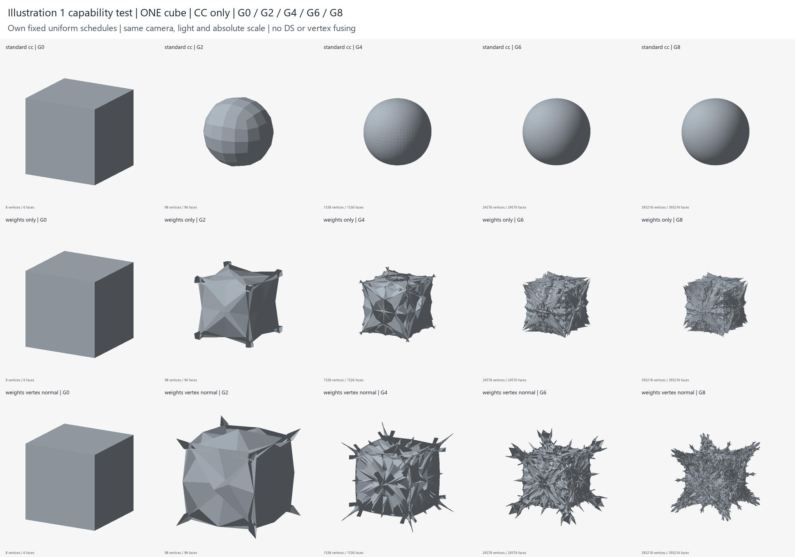

# CHESHIRE — 연구 동결 및 보존 상태

2026-10-10. 현재 생성 알고리즘 연구를 동결한다. 이후 작업의 목적은 확보한 기술과 실제 결과를 이용한 Modern Cliché 게이트 디자인이다. 이 문서는 보존 감사이며, 새로운 형상·가중치·알고리즘 실험을 수행한 보고서가 아니다.

## A. 목적과 역할

**Modern Cliché**는 최종 건축 디자인의 목적이다. **ALICE**는 이미지 해석·정렬, 구조 추출과 초기 기하/파라미터 생성의 별도 프로젝트다. **CHESHIRE**는 입력 메시의 측정, 필드, 명시적 변형, subdivision과 계보를 담당한다. 두 저장소와 환경은 독립적이며, 작은 파일 교환 계약은 [GATE_EXCHANGE_V1.md](docs/GATE_EXCHANGE_V1.md)에 있다. 과거 연구 gate가 ALICE 원본과 동일하다고 보증하지 않는다.

## B. 주요 전환점

| 구간 | 구현과 질문의 변화 | 보존된 판단 |
|---|---|---|
| Task01–08 | 메시 계약 → 측정/필드/규칙/예산 → 법선 변위 → quad 분할·계보 → Rhino worker | 일반 엔진의 기반. 전체 Repeat 자동화의 완성을 뜻하지 않음 |
| Task09–13 | 외부 MOLA의 taper·frame·roof와 선택 규칙, raw/CC 및 배치 대조 | cell별 장식과 smoothing만으로 전체 조직을 해결하지 못함 |
| Task14–18 | weighted CC → coarse carrier → 세대별 Eq4 → DS → 공간 가중치 | 입력 규모·point class·세대별/공간별 배치의 실제 효과 |
| Task19–23 | 실제 장식 자식의 역할·branch signature → sharp placement·crease → cross-cell fold | 위상/계보와 연속 경로 확보. 일반적인 의미 상속은 미완 |
| Task24–25 | 세 hero gate와 H1의 네 갈래 말림 추적, 실제 continuation | 큰 말림·안쪽 홈은 성과. 새 미세 위계는 약함 |
| Task26–28 | 보존 후 방향 전환, 연결 profile/current geometry, 단순 기둥 benchmark | 모두 디자인 PARTIAL. Task26 중단 자체는 방법 실패의 증거가 아님 |
| Task29–31 | 같은 세대 F→E→V coupling 수정, 명시적 CC/DS pipeline, 영역 기억·통로 | 큰 형태와 일부 연속성 개선. 반복 미세 조직과 전체 위계 한계 |
| Task32–36 | 관계 기반 morphology → 부모 방향 fold → 현재 형상 재접힘 → 단면 기둥 → 중립 carrier 연속 fold | 각 유한 연구의 PARTIAL. Task36 U01/W03를 보존하고 T02의 철회도 보존 |
| Astra | 과거 제약 감사, 복구 macro, current geometry 기반 primal/dual/adaptive 대조 | 깊은 다중 규모 내부 골 목표는 미달 |
| Generative Freedom | coherent multi-cell patch/domain 회전과 실제 골의 후속 연결 | J09의 국소 G4–G7 골 연결은 성과. 자기교차가 있는 INVALID 결과 |
| Clean-room A/B | 별도 orphan 구현과 초기 체크포인트, A의 CC-only G8 대조 | A는 기술 성공/디자인 부분 달성. B의 원래 가설은 미실행 |

실제 원본 SHA, 공개 스냅샷 SHA, 코드·레시피·기하·이미지는 [보존 색인](docs/RESEARCH_ARCHIVE_INDEX.md)에 있다. 역사적 문서의 “No push”와 “다음 연구”는 당시 상태이며, 현재 동결 결정이나 동기화 상태를 대체하지 않는다.

## C. 실제 구현된 기술

아래 SHA는 원본 연구 커밋이다. Task30 이후 원본 SHA는 로컬 이력 식별자이며, GitHub의 별도 공개 스냅샷과 구분한다. retained code는 원본과 같은 Git blob이다.

| 기술 | 실제 파일 | 근거 커밋과 범위 |
|---|---|---|
| Weighted Catmull–Clark | `src/cheshire/weighted_subdivision.py`, `reference_subdivision.py` | Task14 계열; `c71ac1f`에서 같은 세대 수정 face→edge→vertex coupling. 두 경로를 같은 구현이라고 부르지 않음 |
| Weighted Doo–Sabin | `weighted_doosabin.py`, `dual_subdivision.py`, `polygon_dual_subdivision.py` | Task17 `ec5c3bc`; Task30 `e66324f`의 polygon/mask와 F/E/V role 경로 |
| Non-stationary / Non-uniform | `generational_subdivision.py`, `subdivision_pipeline.py`, `regional_generation.py` | Task16 `bba4fd7`, Task30 `e66324f`, Task31 `17c0415`; 세대·point class·영역별 선언을 구분 |
| Normal displacement/extrusion | `transforms.py`, `reference_subdivision.py`; A의 `src/subdivision.py` | Task05 `5fb3c7d`, Task29 `c71ac1f`, A `04d0dae`; 거리 단위와 법선 정의는 각 레시피/구현을 따름 |
| MOLA ornament | `mola.py`, `ornament.py`, `vocabulary.py` | Task09 `029bdb7`, Task19 `838490b`, Task24 `385ec86`; 외부 HDMola 런타임 필요 |
| Branching / Lineage | `lineage.py`, `inheritance.py`, `branching.py`, `fold_continuation.py` | Task06 `a85817b`, Task20 `9afa414`, Task25 `b4000cf`; 양의 구성 연관은 전체 signed 기하 영향계수가 아님 |
| Crease / Fold | `crease_routing.py`, `crease_folding.py`, `task33_folds.py`–`task36_growth.py` | Task23 `140932f`, Task33 `767c5e1`, Task36 `0b89c29`; 원래 edge의 계승과 새 장식 edge 의미 계승을 구분 |
| Adaptive subdivision | Astra의 `src/cheshire/astra_adaptive.py` | `0c4ec45`; 면적 선택·centre insertion/old-edge flip과 자체 hinge 변위. 원래 √3 알고리즘 전체 재현 아님 |
| Geometry-responsive domain fold | Astra의 `freedom_patch.py`, `freedom_domains.py` | `0ac8830`; 현재 hinge·graph 거리·영역 회전. 물리적 성장 모델이나 원작 복원 아님 |
| Native state / 실제 단면 / 교환 | `surface.py`, `mesh_io.py`, `gate_exchange.py`, `tools/task3*_*.py` | Task31–36; OBJ는 교환용이며 native/operator/material/ancestry 상태 전체를 대체하지 않음 |

`src/cheshire/`를 생략한 파일명은 같은 디렉터리다. Astra 코드는 [Astra 공개 스냅샷](https://github.com/ChairArchi/CHESHIRE/tree/archive/astra-freedom-2026-10-10/src/cheshire), A 코드는 [독립 구현 스냅샷](https://github.com/ChairArchi/CHESHIRE/tree/archive/hansmeyer-cleanroom-2026-10-10)에 있다. 외부 DLL/환경은 배포하지 않는다. [배포 경계](THIRD_PARTY_NOTICES.md)를 따른다.

## D. 주요 성과와 판정

**Task25 — PROGRESS / PARTIAL.** 큰 말림과 안쪽 홈을 실제 H1 continuation에서 보존했다. 네 갈래 조직은 C07 이전의 modified CC·Taper·standard CC에서 이미 나타나며, 마지막 장식 단계만의 성과가 아니다. 권장 `H1_CURVATURE_G2`는 추가 법선 오프셋을 0으로 두며, 대조군을 크게 넘는 새 작은 접힘 위계는 약하다. [계보 근거](studies/task25/SOURCE_MAP.md), [실제 비교](studies/task25/final_close.png).

**Task36 — PARTIAL.** 중립 기둥의 연속 접힘과 native 상태를 확보했다. 최종 U01 G8은 사전 지정한 유한 높이 13개 중 3곳에서 새 내부 basin을 보고했다. W03의 실루엣 개선은 같은 고정 prominence에서 G7/G8의 새 내부 골 증가를 뜻하지 않는다. 이전 `T02_VERIFIED_BVH_G8`의 검증은 edge-aligned 교차 누락 발견 후 철회됐다. U01/W03의 보완 검사도 공면·접선·경계 접촉, 최소 두께·제작 가능성까지 인증하지 않는다. [원래 결과와 한계](docs/TASK36_RESULTS.md).

**Astra / Freedom — PARTIAL.** 현재 형상이 다음 제어를 바꾸는 인과 대조와 국소 재귀 접힘을 확보했다. J09에서 같은 원래 부모 구간의 G4–G7 골 연결을 추적했지만, 유한 단면의 성과이며 결과에 자기교차가 있다. 전체 형상, 유효 solid, 무한 지속 위계 또는 Alternating Fold–Protrusion Growth의 입증으로 확대하지 않는다. [Freedom 결과](https://github.com/ChairArchi/CHESHIRE/blob/archive/astra-freedom-2026-10-10/docs/FREEDOM_RESULTS.md).

**Clean-room A — TECHNICAL SUCCESS / DESIGN PARTIAL.** 단일 cube, Modified CC only, G0–G8, Standard / modified weights / modified weights+독립 vertex-normal extrusion의 세 대조다. G8은 각각 393,218 vertices / 393,216 faces이며 DS와 vertex fusing은 사용하지 않았다. 수정 가중치만으로 G1부터 돌출·골이 생기고 후기의 각진 작은 구조가 증가했다. 같은 연결에서 좌표가 실제 달라지므로 밀도 증가만의 결과는 아니다. 그러나 가시·결정질 반복에 치우치며 Illustration1의 깊고 조직적인 다중 규모 장식 품질은 달성하지 못했다. 레시피는 직접 선정한 시험값이며 비공개 원작 파라미터가 아니다.

기존 최소 수학·위상 검사와 메시 재읽기 기록을 보존했다. 이번 보존 작업에서는 재실행하지 않았다. 자기교차 부재·양의 solid·제작 가능성은 확인하지 않았다. 기존 CHESHIRE보다 우수한 새 생성 알고리즘의 발견이라고 주장하지 않는다. [원래 결과](https://github.com/ChairArchi/CHESHIRE/blob/archive/hansmeyer-cleanroom-2026-10-10/docs/ILLUSTRATION1_CAPABILITY_RESULTS.md), [정확한 레시피](https://github.com/ChairArchi/CHESHIRE/blob/archive/hansmeyer-cleanroom-2026-10-10/experiments/illustration1/recipe.json).

**Clean-room B — RAY PROJECTION POC COMPLETE / ORIGINAL HYPOTHESIS NOT TESTED.** INPUT Frame에서 TARGET Cylinder로의 ray projection은 실제 동작했다. 반복 Cut–Mirror–Union, plane 위치·방향·순서 탐색, TARGET 거리 평가 최적화는 이 독립 B에서 구현·실행하지 않았다. `FAILED TARGET-GUIDED GENERATION`으로 기록하지 않는다. Astra의 별도 미커밋 mirror 연구와 B의 검증 상태를 합치지 않는다.

## E. 확인된 한계

- 전체 형상에 걸친 Macro–Meso–Micro 관계는 부족하다. 일부 높이·일부 부모의 국소 성공을 전역 조직으로 일반화할 수 없다.
- 반복적인 부모 face/panel 경계가 후기 조직을 지배한다. 많은 면과 깊은 조형은 별개다.
- 반복 subdivision과 평균화는 기존 특징을 완화할 수 있다. 반대로 강한 signed 배치·오프셋은 가시, 교차, 파편화를 만든다.
- 생성 계보가 있다는 사실은 새로운 돌출·골의 발생, 부모 내부의 공간적 포함 또는 인과적 재귀를 자동 입증하지 않는다.
- 저장된 검증은 각각 명시한 검사 범위에 한정된다. 최종 제작용 solid·두께·접합·물리 단위는 별도 디자인 판단이 필요하다.

## F. 실패와 미검증 가설

| 항목 | 현재 판정 | 근거와 해석 |
|---|---|---|
| Task25 AMPLIFIED의 강한 child 외삽이 읽기 좋은 미세 접힘을 만든다 | 시험값에서 목표 미달 | 각진 파편·겹침 증가. Modified Subdivision 전체의 불가능성 아님 |
| Astra D01 G9 / Freedom J11·J12 G8의 유효 기하·지속 위계 | 해당 결과 FAILED / INVALID | D01 G9 교차; Freedom G8의 같은 골 5세대 지속 연결 미달 및 교차. 보존된 유효 prefix/국소 성과와 구분 |
| Task36 T02의 이전 교차 안전 판정 | WITHDRAWN | 검증 predicate 누락. 이름의 VERIFIED를 현행 인증으로 사용하지 않음 |
| Alternating Fold–Protrusion Growth | **NOT VERIFIED** | Task24·25/Astra의 레시피·저장 계보·실제 적용 변위를 검토. 순서 및 부분 기하 반응은 있으나 요구한 연속 발생 과정의 직접 추적 부족. [정적 감사](docs/ALTERNATING_FOLD_PROTRUSION_AUDIT.md) |
| 독립 B의 target-guided recursive symmetry | **UNTESTED** | 제한된 ray mapping POC만 완료. 원래 가설 실패 아님 |
| 비공개 Hansmeyer 레시피 복원, 충분한 전역 다중 규모 생성 범위 | **UNTESTED / NOT ESTABLISHED** | 공개 수식의 구현과 제한된 자체 시험값만 확인 |
| 최종 제작 가능성 및 모든 형태의 자기접촉 부재 | **UNTESTED** | 기존 횡단 교차 검사·위상 검사와 별개 |

## G. 이후 방향과 보존 경계

신규 알고리즘, 가중치 탐색, G9 연장과 B 재구현은 동결한다. Hansmeyer 재현은 현재의 필수 성공 조건이 아니다. 목표는 설명 가능한 생성 원리와 독자적인 건축 형상을 가진 Modern Cliché 게이트이며, 깊이와 복잡성은 여전히 중요한 디자인 조건이다. 이후 디자인은 실제 레시피·native 상태·큰 말림·연속 접힘을 회수해 별도 요청에서 진행한다.

Task24–29와 B는 안전한 원본 이력을 공개한다. Task30 이후 계보에는 재배포 권한 미확인 비교 시트가 있어 원본 브랜치 푸시를 보류하고, 해당 시트를 제외한 **새 archive 스냅샷**으로 코드·레시피·자체 결과를 공개한다. A는 대형 메시/체크포인트와 개별 렌더를 로컬에 두고 코드·레시피·선택 비교 이미지의 별도 스냅샷을 공개한다. 원본 이력의 재작성·삭제·merge·force push는 없다.

전체 원본 로컬 heads의 Git bundle과 Astra 미커밋 58파일의 별도 바이트 사본은 `C:/Users/USER/CHESHIRE/archive-local/2026-10-10/`에 있다. 외부 대형 자료는 `E:/CHESHIRE_DATA/`, A/B 원본은 각각 기존 cleanroom worktree에 남는다. **이 경로의 LOCAL ONLY 자료는 GitHub에서 다운로드할 수 없다.** 로컬 bundle은 별도 장치의 백업을 뜻하지 않는다. 공개/로컬 SHA 대응, 실제 해시와 누락 범위는 보존 색인을 따른다.
