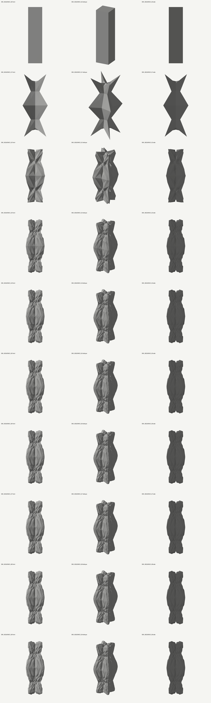
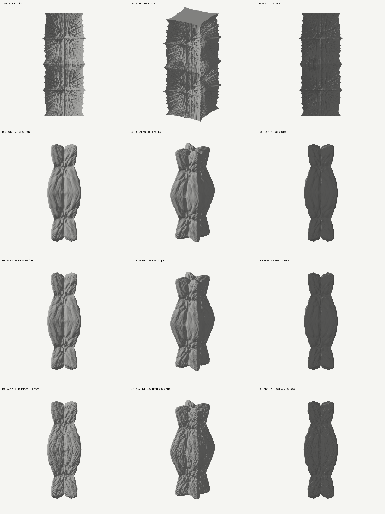
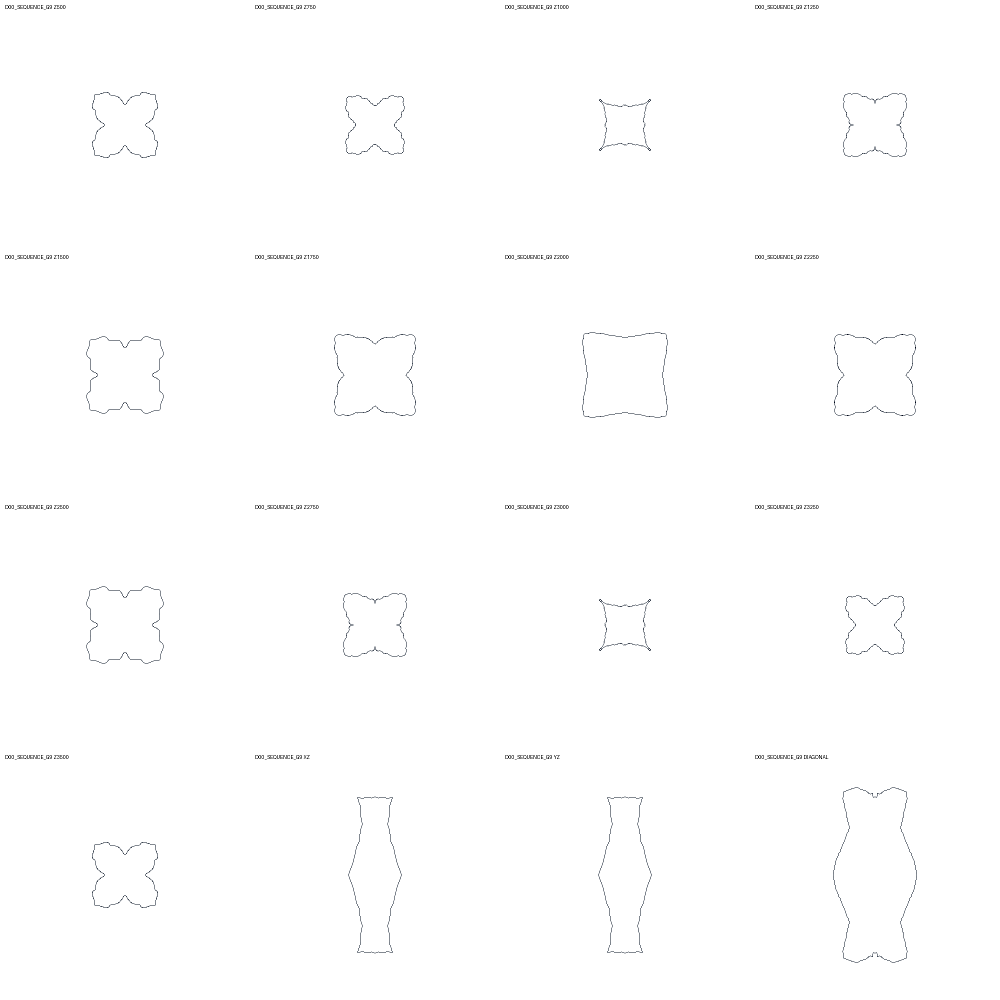

# ASTRA 독립 연구 결과 — 2026-10-10

**전체 목표: PARTIAL / Digital Grotesque 수준의 계층적 조형 미달.** 단순 직선 사각기둥에서 큰 팽창부·잘록한 연결부·비틀린 능선을 생성하는 과거의 유효 경로를 복구했고, 생성된 형상이 다음 세대의 제어와 연결 구조를 바꾸는 독립 엔진을 구현했다. 그러나 이번 새 후보는 Task36보다 깊은 다층 접힘을 확보하지 못했다. 후반부에 큰 구조는 남지만 그 안에 충분한 깊이의 새로운 골이 계속 발생하지 않는다. 이것을 면 수나 제어 반응의 증가로 성공 처리하지 않는다.

작업: `C:/Users/USER/CHESHIRE_ASTRA`, branch `research/astra-independent`. 기준 `7f813dd58a6540a4b66745f96590afe2c9eec7be`, 고정 보존 tag `checkpoint/pre-astra-baseline`. 새 대용량 자료는 `E:/CHESHIRE_DATA/astra_research/`에만 기록했다. 원본 CHESHIRE와 Task01–36 자료는 변경하지 않았다. 로컬 보존 커밋은 이 문서를 포함하는 연구 커밋이며 정확한 해시는 외부 `verification/preservation.json`에 기록한다. Public GitHub에 push하지 않는다.

## 1. 실제로 발생한 형상과 그 다음 변화

초기 carrier는 X/Y 폭·깊이1000, Z 높이4000의 직선 정사각기둥이다. 좌표 단위는 연구 단위이며 mm로 확정하지 않았다. 구간2의 균일 입력으로 세부 장식을 미리 새기지 않았다.

- **G0→G1:** 복구한 강한 face/edge/vertex 위치식이 가운데 팽창부와 위아래 결속, 갈라지는 끝단을 만든다. 원래 profile을 변형한 것이 아니라 실제 신규점 배치의 결과다. 이 단계의 절대 offset −280/+320/+520와 전역 scale은 레시피에 노출돼 있다. G1에 특정 모양을 맞춘 보정이나 bbox 재정규화는 없다. 다만 과거에서 가져온 세대별 레시피이므로 완전히 동일한 stationary 규칙의 자연발생이라고 부르지 않는다.
- **G1→G3:** 실제 수정 face를 edge/vertex에 전달하는 coupled weighted CC가 큰 부피 안쪽과 연결부에 각진 능선·골을 만든다. 판과 능선의 방향성도 이때 발생한다. 입력이 단순해서 무조건 작은 요철밖에 만들 수 없다는 가설은 이 대조로 지지되지 않는다.
- **G3→G9(D00):** 현재 triangle 면적과 signed hinge를 다시 읽어 큰 면을 분할하고, 양쪽 면이 선택된 edge를 뒤집어 옛 edge 방향의 독점을 줄인다. 새 face의 normal과 hinge가 다음 offset을 결정한다. 전체 팽창·결속은 유지되고 판 구성이 더 유연해지지만, 큰 골 내부에 깊은 작은 골을 지속적으로 추가하는 데는 실패했다. G5 이후 외곽 변화도 작다.
- **D01:** 평균 hinge 대신 최대 절댓값 hinge를 사용하면 더 날카로운 국소 변화가 생긴다. G8은 검증되지만 G9에서 횡단 교차24건이 발생한다. G8만 교환 후보이며 G9 실패도 보존했다.

대칭은 X/Y 반사와 이 입력에서 생긴 90도 회전 대칭을 유지한다. 단면이 정사각형 경계를 벗어나는 것을 금지하지 않았다. **D00 끝단은 자유롭게 움직이며 바닥 고정·접합 단면 규약이 없는 연구 표면**이다. 게이트 제작용 기둥으로 완료한 것이 아니다.

## 2. 독립 감사에서 확인된 사실

상세 계보는 [역사·제약 감사](ASTRA_HISTORY_AUDIT.md), 원문 식과 출처는 [문헌·primal 연구](ASTRA_PRIMARY_METHODS.md), 복구 실험은 [dual·과거 경로 재검증](ASTRA_DUAL_EXPERIMENTS.md)에 연결한다.

| 확인된 내용 | 실제 근거와 해석 |
|---|---|
| Task36은 단순히 smoothing을 끈 구현이 아니다 | `weighted − standard CC` 차분을 interpolation에 더한다. 기존 정점의 CC 평균 이동을 취소하며 negative diagonal stencil이 강하게 작용한다. 저장 U/W 상태의 위치식을 오차≤1.82e−12로 재구성했다. |
| 초기 carrier 외곽 고정 하나가 주된 원인은 아니다 | 같은 U01 G2에서 averaging/diagonal 조건을 바꾼 단일 단계가 폭과 내부 hinge를 바꾼다. 원래 경계 밖으로 이동하는 점이 있고 bbox rescale은 없다. 판을 줄이는 대조는 좋은 깊이도 줄였다. |
| 잘못된 coupling을 새로 발견한 것이 아니다 | 현행 reference는 이미 수정 face→edge→vertex 순서를 적용한다. 과거 Task36 full-CC/averaging 대조도 확인했다. 이번 차이는 실제 합성식과 signed 계수의 기여도를 분리한 것이다. |
| 강한 초기 형상 생성 경로가 과거에 존재했다 | Task29 cube G0–G6 operator 배열을 정확 복구했다. Task28 계열의 macro 숫자를 중립 기둥과 현행 corrected engine에 이전한 K03/B00도 일치했다. 후자는 역사적 Task28의 byte-exact 재현이라고 부르지 않는다. |
| pure dual은 큰 내부 면의 세분화를 자동 보장하지 않는다 | 한 대조에서 최초 중앙10면은 G4에도10면이며 전체 면적23.33%를 차지했다. 전체 polygon 수2562 증가와 큰 면 내부 접힘 발달은 별개다. |
| 현재 형상 반응은 실제로 작동한다 | current/rest 대조, mean/dominant 대조, adaptive/uniform 대조에서 위치·선택·다음 연결이 달라진다. D00 G9 164000삼각형과 D04 reference 283984삼각형은 선택이 다른 결과다. `rest`는 진화하는 기준 embedding이며 초기 feature 값을 완전히 동결한 대조는 아니다. |
| 해상도만으로 해결되지 않았다 | uniform D02 G9는1866240삼각형까지 검사했지만 아래 유한 단면에서 새로운 깊은 child basin은0이었다. E00 exact midpoint 분할은 원래 표면을 그대로 재표본하는 대조다. |

**아직 가설:** 안정적인 음의 stencil 범위가 풍부한 접힘에 충분한지, coherent multi-cell patch가 반복적인 내부 분기를 만들 수 있는지, topology 변화가 목표 조형의 필수 조건인지. 이번 실험으로 불가능성을 증명한 것은 아니다. smooth shading, scalar diffusion, 실제 XYZ averaging은 서로 구분했다.

## 3. 구현한 엔진과 선택 근거

[통합 실행기](../tools/astra_recipe.py)는 8종 operator를 명시적 레시피로 실행하며 native 삼각 표면과 다음 단계용 operator mesh/state를 별도 보존한다. 기존 production 경로를 교체하지 않은 독립 연구 엔진이다.

1. **Intrinsic primal:** 면 종횡비·순환 불변 planarity·인접 bend가 CC weight를 조절한다. current/rest, signed stencil, support normalization을 분리했다. 보수적인 범위는 얕고 강한 조건은 교차했다.
2. **Dual 및 실제 F/E/V role:** parent 역할과 주변 support에 따른 Doo–Sabin 위치 제어, CC/DS 교대, 실제 polygon 내부 sampling을 구현했다. frames와 판의 유지 또는 얕은 곡면으로 수렴해 최종 경로로 채택하지 않았다.
3. **Rotating/adaptive triangle:** √3의 centre insertion/old-edge flip 연결 아이디어를 참고하되 자체 relaxation/hinge 변위를 사용했다. 원논문의 smoothing mask나 극한면 보장을 재현한 것이 아니다. 적응 분할은 같은 범위의 큰 형상을 훨씬 적은 triangle로 보존했다. 단, 더 풍부한 계층을 입증한 것은 아니다.
4. **Coherent curvature response:** 입력 삼각형에서 signed mean-curvature proxy를 계산·scalar 확산한 뒤 exact midpoint 정점으로 전달하고 전체 정점에 normal 변위를 적용했다. 국소 셀 크기와 분리한15/30단위 변위, 단조/비단조 반응, 확산 없는 대조, reference 대조를 수행했다. 새 깊은 내부 골의 근거를 확보하기 전에 G5–G7 교차가 발생했다. 실패를 고치기 위해 기존 기준을 완화하지 않았다.

선택한 D00의 후반식은 triangle inradius `r`, 인접 signed hinge 평균 `b`에 대해 `offset = r·fold·tanh(bias+3·feedback·b)`이다. 현재 면적 quantile을 넘는 face에 centre를 삽입하고 양쪽이 선택된 old edge만 flip한다. retained vertex의 이웃 평균 이동은 incident selected-face 비율로 가중한다. 따라서 순수 subdivision-only도, smoothing-free도 아니다. `operator_state.npz`가 실제 선택·부모쌍·적용 변위를 기록한다. 전체 수식·I/O·검사 계약은 [구현 설명](ASTRA_IMPLEMENTATION.md)을 따른다.

추가 정교화보다 **과거의 강한 macro 경로 복구와 여러 경쟁 operator의 대조**가 더 유용하다고 판단했다. 새로운 거대 framework, arbitrary ornament library, gate 조합은 만들지 않았다. 새 방식이 다층 깊이에서 Task36보다 우월하다는 주장은 보류한다.

## 4. Task36 및 참고 특성과의 비교

아래는 Task36 U01 G7, B06 G8, D00 G9, D01 G8 순서다. 모든 열은 정면/사선/정확한 측면이며 width5000, targetZ2000, 같은 조명·flat shading·비금속 clay를 사용했다. 후보마다 scale을 맞추지 않았다. 세대·면 수는 같지 않으므로 동일 계산 예산 대조로 해석하지 않는다.

| 평가 축 | 결과 |
|---|---|
| 큰 팽창·결속·재발산 | 초기 G1–G3에 실제 발생하고 후반에도 유지된다. 선택 후보는 원래 사각 외곽과 다르다. |
| generated geometry → next control | 상태와 current/rest·nofold 대조로 입증했다. 제어 반응의 존재가 조형 성공을 뜻하지 않는다. |
| 깊은 다중 스케일 내부 골 | 미달. 13개 사전 지정 chart 높이,2048방향, prominence15 기준에서 B/D 선택 후보와 E02/E05 유효 prefix의 신규 child basin은 모두0. Task36 U01 G8의 기존 보고3/13을 넘지 못한다. 측정 경로 차이가 있으므로 이를 정밀 순위 점수로 만들지 않는다. |
| 부모의 큰 접힘 유지 | B06 G7→G8 유한 parent envelope 비율 min/median/max 약.9748/.9938/1.0253. 큰 형상 유지는 새 내부 발달과 별개다. |
| 구간별 조형 차이 | 몸통·결속·끝단 차이는 있으나 원작의 지역별 상이한 분기와 깊이·밀도에는 못 미친다. |
| 일반성 | cube와 짧은 column에서 같은 macro/rotating 계열의 유효 실행을 확보했다. 다층 장식의 입력 일반성을 입증한 것은 아니다. |
| topology/genus | 새 연산은 genus0 유지. 과거 Task31 고정 mouth는 발생적 porosity가 아니다. 이번에 emergent genus 변화는 구현하지 않았다. |

참고 이미지의 큰 돌출부가 다시 변하고 내부에 다른 규모의 접힘이 자라는 특징과 비교하면, D00는 큰 돌출의 **후속 재조직보다 유지·완화**가 강하다. 이미지와 닮게 만들기 위한 후처리나 초기 profile은 넣지 않았다. Hansmeyer의 비공개 제작 레시피를 재현했다고 주장하지 않는다. 출처는 [공식·원논문 조사](ASTRA_PRIMARY_METHODS.md) 및 기존 [참고문헌](astra/REFERENCES.md)에서 확인할 수 있다.

## 5. 단면 측정과 유효성의 범위

세계 좌표의 Z500..3500, 간격250, 퇴화 회피 offset.12345에서 native triangle을 직접 절단하고 XZ/YZ/대각 종단도 보존했다. 별도 hierarchy 검사는 rest-Z 절단의 barycentric support를 현재 삼각 표면으로 옮긴다. triangle ID·끝점 가중치·실제 XYZ를 저장하며 재구성 오차는 약1.4e−12 이하였다. 연결 변경 후 chart는 재구성되므로 고정 material curve 또는 연속적인 ridge 전체의 인증이 아니다. 0건은 **이 유한 위치와 깊이 기준에서 확인하지 못함**이며 모든 3D 접힘의 부재라는 뜻은 아니다.

| 검증된 교환 후보 | 정점 / 삼각형 | 횡단 교차 | 대칭 최대 오차 | OBJ |
|---|---:|---:|---:|---|
| D00 G9 | 82002 / 164000 | 0 | 1.864e−12 | `deliverables/D00_G9_RESEARCH/D00_G9_RESEARCH.obj` |
| D01 G8 | 40994 / 81984 | 0 | 1.375e−12 | `deliverables/D01_G8_RESEARCH/D01_G8_RESEARCH.obj` |

둘 다 finite, 단일 연결 성분, Euler2, 유효 vertex links, 퇴화·orphan 없음. X/Y 반사와90도 회전은 일대일 정점 대응 및 oriented triangle cycle로 확인했다. 모든 삼각형과 공유 정점 쌍을 포함해 기존 strict/interval 교차 합집합을 검사했다. OBJ를 다시 읽은 모든 좌표와 면은 정확 일치했다.

**공면 overlap, 접선 및 경계만의 접촉은 제외한다.** 최소 두께·제작 강도·완전한 solid 인증은 하지 않았다. D01 G9는24건, B05 G7는720건이다. 일부 실패의1024는 검사 cap에 도달한 하한이며 정확 총합으로 쓰지 않는다. INVALID 렌더·native를 보존했고 유효 OBJ와 구분했다.

## 6. 재현·비용·회귀

- 최초 기준 전체 테스트979개 통과를 확인했고, 최종 **1024 passed in53.94s**(기존979+신규45)를 확보했다. 기존 소스·테스트 기준은 수정하지 않았다. 첫 최종 실행은 임시 폴더의 상위 경로 누락으로945 passed/79 setup errors였고, 경로만 만든 재실행에서 모두 통과했다. 두 로그 모두 `commission/final_pytest*.log`에 남긴다.
- D00 G0–G9, D01 G0–G8을 처음부터 재생성했다. native/operator mesh/operator state **55 NPZ가 SHA256까지 동일**하다. `verification/replay_comparison.json`에 양쪽 절대경로·해시를 기록했다. 이는 현 환경·보존 소스의 재현 결과이며 모든 플랫폼의 bitwise 재현 보장은 아니다.
- D00 전체 생성+검사17.10초, 관측 process tree+driver peak359.5MiB. D01 유효 G8 replay10.84초,272.4MiB. Uniform D02 G9는124.41초,2458.9MiB였다. 렌더·별도 hierarchy/export 비용은 여기에 포함하지 않으며 각 실행의 `execution.json`을 따른다. 이는 한 번의 실행 기록이고 통계적 성능 벤치마크가 아니다.
- 큰 실행 전 보수적인 메모리 예측, 실행 중 process RAM/free-memory guard를 유지했다. 마지막 export 검사는 선택한 작은 후보를 직접 실행했고 별도 process guard가 있는 것으로 주장하지 않는다.
- 정확한 source snapshot·해시·레시피·실패 checkpoint·요청/적용 제어를 기록했다. 통합 runner는 저장 source를 자동 import하는 것이 아니라 현재 worktree를 실행하고 시작/끝 해시를 검사한다. 재생 시 소스가 달라지면 원실험 재현과 구분해야 한다.

실행 방법과 전체 실험표는 [실험 색인](ASTRA_EXPERIMENT_INDEX.md), 후속 판단은 [다음 연구](ASTRA_NEXT_STEPS.md)에 있다. 이번 구현은 독립 실행·회귀·재현이 가능한 연구 기반을 제공하지만, 원작 수준의 조형 목표를 완수한 엔진으로 배포하지 않는다.
