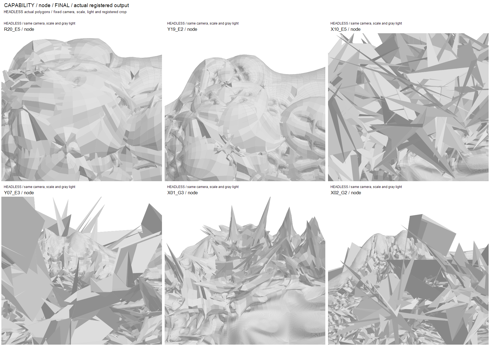

# Task23: cross-cell creases and design-first fold synthesis

Task22 baseline: `66cb4f90d0b15834d358db5ce2569c813379b0b1`.
Work is isolated on `experiment/task23-cross-cell-crease-hero`. The original
geometry, protected branches, Task17 checkpoint and all existing Rhino modes
remain intact. Heavy evidence uses the explicitly supplied external root;
recipes identify artifacts relative to that root.

## Reference rules and experimental composition

See [the reference contract](CROSS_CELL_CREASE_REFERENCE.md) for actual installed
COMPAS 2.15.1 behavior and checked DeRose/OpenSubdiv sources. Integer coordinates
and oriented face ordering match installed COMPAS exactly on nine independent
cube/column/U-gate comparisons. Fractional finite Uniform transitions are
implemented separately; they are not COMPAS truthy fractional attributes, the
original variable Chaikin appendix, or a new dependency.

`CreaseNetwork` stores a connected actual mesh-edge graph, canonical seed/routing
JSON, per-edge finite sharpness, immediate and root edges, generation, geometric
length and available frozen parent/C0/motif ancestry. Canonical JSON SHA256 is
the portable identity; Python's ordinary in-process hash is not a file identity.
Each CC edge yields two structurally proved descendants. Zero-sharpness edges
remain as the declared-route comparison, so a structural junction count does
not imply an active sharp corner after decay. Overlaps use maximum sharpness
for geometry, while each network retains its own state and ancestry.

The later user override authorizes a design-first additive composition of
existing point placement with reference crease CC. It applies
`P_crease + alpha*(P_existing_sharp_weighted - P_standard_smooth)` using a declared
current-network graph band. This is a **CHESHIRE composition**, not a published
crease mask. Literal Eq10/11 and weighted CC remain unchanged. Each generation
serializes all nine controls, support radius and motif values; `w3/w4` remain
zero because this composition does not invent later point-origin stencils.
Normal offsets use absolute original model units. Matched face/edge/corner
normal offsets were subsequently tried to replace X02's competing shard field
with a broader continuous fold.

The only changes to existing adapter APIs are optional `allow_large_taper`
keywords. Ordinary callers retain the 0.5 ceiling. Task23 may explicitly use
finite larger heights; the official DLL call, local polygon checks, fractions,
constructor ordering/oracles and budgets remain unchanged. A real unit quad at
height ratio 1.0 returns 5 faces/8 vertices with cap z approximately
0.999999983, preserving the actual float32 precision.

## Routing and lineage

N1 connects architectural outer-lintel, opening-rim or shoulder/lintel targets.
N2 walks for tangent/direction/source continuity. N3 combines a geometric
high-dihedral seed with an architectural cue. N4 starts at a surviving recorded
Task21 Roof ridge and extends its actual direction. N5 creates sparse bilateral
shoulder fans. N6 creates controlled T/X/Y junctions with distinct first edges.
All operate on current mesh edges with deterministic tie breaks; no terminal
edge IDs are manually selected. Immediate return loops and revisited vertices
are excluded in the continuity walk. Source eligibility and every actual path
are recorded before refinement.

The default routing cue uses normalized C0 x/z and front-depth ratio -0.65.
The refinement explicitly moves selected cues to -1.05 and records the new
source-support thresholds. Dijkstra combines edge length, turn, source/front
eligibility and dihedral/cell-crossing preference; continuity walking additionally
uses preferred direction and a turn bound. These routing costs and sharpness
profiles are design decisions, separate from the reference equations.

Cross-cell means at least three frozen parent cells **or** two coarse C0 faces.
Both counts are reported. Counts alone do not prove a visible meso trajectory.
Positive face histories and branch paths are preserved. They are construction
associations, not signed geometric coefficients or generic semantic inheritance.
Task22 motif labels come from actual saved input point records. Mola terminal
creases retain only proved unchanged corner copies/actual output edges; affected
derivatives explicitly have **crease semantics NOT IMPLEMENTED**.

## Contacts and resource safety

The original screen retained its original policy in the saved requests. The
subsequent explicit user override removes all contact-count growth vetoes.
The deterministic nonadjacent transverse-contact sampler may stop counting at
256. Positive contacts are `SELF_INTERSECTING_CAPABILITY`; the cap never stops
the requested sequence. X02 continues from capped G1 (256) to G2 (217); X04
continues through two capped generations. Different-resolution sample counts
are not a global intersection estimate or proof that intersections disappeared.
Coplanar/adjacent contacts are excluded; exhaustive enumeration is not attempted.

Hard boundaries remain nonfinite coordinates, unusable topology/next operator,
catastrophic zero-area degeneration and unsafe resource use. A small local
polygon rejected by a Mola constructor is reported rather than repaired.
Gate proportions and anchor drift are monitor-only. The monitor follows equal
original-corner landmark contributions and is not exact free-opening clearance.

RAM is approximately 31.927 GiB. Every case retains the existing 4 GiB process
tree plus driver guard, shared available-memory floor, 900-second timeout and
12 GiB external-disk floor. Ordinary requests retain a 300,000-face ceiling.
Collision diagnostics have their own 120-second guard. E: storage is not RAM;
no limit was raised. Checkpoints precede diagnostics. Stage timings separate
operator, collision, serialization and cumulative time; sampled process peaks
are recorded, rather than inferred from mesh counts.

## Evidence and reproduction

The study starts from exact frozen C07, Task22 sharp and Task21 ordered artifacts
and saved fragments. Raw meshes/checkpoints remain external. Fixed Task21/22
front/oblique cameras and scale are used throughout, with actual gray polygons.
One additional uniform upper-left node crop derives only from C0 dimensions;
it cannot substitute for whole-gate assessment. Wireframe and network/sharpness/
C0-ancestry/high-dihedral/ornament-depth views use actual saved geometry.
Network overlays include hidden edges and are declarations, not physical-fold
proof. The 20-degree route-survival statistic is a geometric normal-contrast
proxy, not pixel visibility, occlusion-aware rendering or an aesthetic score.

Completed baseline cases are not restarted after the override. Superseded
queues are stopped with process-creation verification; saved interrupted
checkpoints remain labeled as interrupted. Ten large combined designs replace
the remaining conservative comparisons, followed by two observed coherent-fold
refinements. Where an old taper-domain check stopped a case after Roof/frame,
an explicit continuation uses its real saved checkpoint instead of repeating
the fold computation. Original stopped attempts remain visible in the ledger.

Final selection, visual questionnaire, factual tables, exact independent
reproduction, tests and distribution audit are recorded in `studies/task23`.
Full external data additionally retain source-byte snapshots and failed stages.
The compact review archive contains selected actual geometry and the frozen
input closure, never the DLL, upstream sources, environment or local settings.

## Completed study and visual decision

There are 30 distinct controls (40 retained attempts), 92 named gate requests
and 88 distinct gate strategies after subtracting four checkpoint continuations.
The gate pool includes the matched A16 no-network control. Development probes,
four pilots and two independent reproduction proofs are counted separately.
Of the 92 requests, 84 complete, six retain technical stops and two are
interrupted by the explicit policy revision. Four of those stops are old taper
domain checks; their real saved checkpoints subsequently complete via Y tails.
All twelve post-override logical design directions therefore complete.

| Phase | Named requests | Latest complete | Technical stops | Policy interruptions |
|---|---:|---:|---:|---:|
| Controls | 30 | 30 | 0 | 0 |
| Screen | 30 | 30 | 0 | 0 |
| Design | 39 | 36 | 2 | 1 |
| Refinement before revision | 6 | 5 | 0 | 1 |
| Prior contact-territory continuation | 1 | 1 | 0 | 0 |
| Large capability / coherent refinement / tails | 16 | 12 | 4 | 0 |

Forty-two gate requests (38 logical strategies) contain sampled contacts at some
checkpoint; many inherit them at G0. Nine primary trajectories reach the
diagnostic cap. Neither these totals nor changing samples measure the number
of new intersections generated. EX01's selected G0 is the actual previous
Task22 75-contact input, explicitly not a Task23 terminal output.

The expanded morphological spread is real. X01 creates a large angular left
branch; X02 creates a shard field; X10 creates a bilateral angular mantle; Y07
creates very large clipped branches with deep nesting. They remain computable.
Y19 is the relatively legible/orderly direction. R20 is retained for its
coordinated placement and exact replay. None demonstrates all eleven Grotesque
criteria. Broad swelling, star-node pinching, visible intersections and detail
occlusion remain. The fixed camera clips extreme branches; full geometry is
retained rather than hidden by reframing.

The **single strongest limitation** is a coherent meso fold that replaces the
inherited panel scaffold. Local point placement produces swollen panels or
shard fields. Structural cross-cell ancestry and high normal contrast do not
establish that missing visual hierarchy. Variable profiles have no demonstrated
gate-wide advantage. Junctions create angular convergence and spikes, but not
usefully controlled hierarchical nodes.

These are headless actual polygon projections, not Rhino screenshots. Painter
sorting and first-triangle normals approximate shading/occlusion, particularly
on intersecting polygons. Network overlays additionally draw hidden edges.
Neither is a collision certificate. No AI images or beauty renders are used.

## Principal results and retained recipe

| Actual result | Faces | Final sampled contacts | Seconds | Peak tree plus driver bytes |
|---|---:|---:|---:|---:|
| R20 | 72,144 | 25 | 254.19 | 770,068,480 |
| Y19 tail | 72,060 | 17 | 97.72 | 973,398,016 |
| Y07 tail | 72,144 | 256, capped | 143.11 | 1,002,844,160 |
| X01 | 286,720 | 3 | 241.20 | 1,618,231,296 |

Y runtimes cover the resumed segment, not the earlier retained prefix. R19's
prefix took 176.83 seconds; X07's took 190.33. Full per-stage operator,
diagnostic and serialization times remain in actual attempt summaries. The
largest measured finished peak in the gate/control ledger is 1,966,911,488
bytes, below the unchanged 4 GiB guard. EX01 has an explicitly separate
large-face diagnostic request; it is not a production Hero run.

R20 starts from frozen C07 and routes two N5 fans, sharpness 12, normalized
seed x/z (-0.44, 0.98)/(0.44, 0.98), front-depth ratio -1.05. G1 uses band 9,
wf/we/wp = 500 model units and every interpolation/Eq10/11 control zero. G2
uses band 4 and all controls zero, preserving reference creases. No global
finish is applied. Sparse actual events follow in order:

1. Roof: height_ratio 1.0, vertical basis, gable_inset 0.2, at most 48 events.
2. InsetFrame: width_ratio 0.12, at most 20.
3. TaperedExtrusion: height_ratio 1.4, fraction 0.22, at most 20.
4. InsetFrame: width_ratio 0.08, at most 20.
5. Second TaperedExtrusion: serialized height_ratio 0.9099999999999999,
   fraction 0.22, at most 20.

Selectors, C0 stratification, quiet regions, stage indices, source fragment
references and parameter deviations are fully recorded, rather than implied
by this short recipe. R20 reaches actual constructive depth 7; Y06 reaches 8.
Selective detail exists in close views but is partly lost in whole views.
R20's two actual traces span 87/92 parent cells and 3/3 C0 ancestries, with
20-degree contrast length ratios 0.969/0.967; those numbers do not certify
coherent visible meso organization.

Retained labels and the sixteen selections are in
[selection.json](../studies/task23/selection.json). The ten-question visual
reviews and eleven-criterion decision are in
[visual_review.json](../studies/task23/visual_review.json). They are explicit
agent assessments, not an independent human jury. Only a context-bound,
actually verified six-generation `LONG_CREASE` control enters the separate
Task23 library extension; weak gate mechanisms are excluded.

## Gate drift, verification and delivery

| Monitor relative to C0 | R20 | Y19 | Y07 |
|---|---:|---:|---:|
| Opening width ratio | 0.996755 | 0.998096 | 0.998795 |
| Opening height ratio | 0.801144 | 0.804675 | 0.808274 |
| Overall width drift | +19.395% | +17.569% | +137.194% |
| Overall depth drift | +203.558% | +176.407% | +719.169% |
| Overall height drift | +20.043% | +16.825% | +61.057% |
| Base mean lift, model units | 460.554 | 460.583 | 460.595 |

All original-corner landmarks survive for these monitors. Support order and
lintel relation remain recorded; these are not exact aperture clearance or
architectural feasibility claims. Original units are not reinterpreted as mm.
Principal retained outputs are finite, closed/manifold, with zero degenerate
fan faces. Contacts remain explicitly `SELF_INTERSECTING_CAPABILITY`.

The original R20, a fresh benchmark and an independent original-backbone replay
match canonical geometry, networks, histories/events/anchors, signatures and
branch diagnostics exactly. Benchmark/replay take 221.86/219.30 seconds. See
[retained_reproduction.json](../studies/task23/retained_reproduction.json);
compressed byte timestamps and process timings are intentionally not identity.
The existing resume contract also verifies actual artifacts and unchanged
source bytes. Input and source identities are relative and hashed.

The full existing suite ran **once** with the official DLL enabled: **788 pass,
1 fail in 37.28 seconds**, no skips. The existing worker identity negative test
had been given repository-internal `--basetemp`, invalidating its intended
outside-repository package premise. Only that test was rerun with a fresh
outside-repository temporary directory: **1 pass in 0.07 seconds**. All 789
unique tests are verified. Existing test/code expectations were not weakened.
This is not presented as a clean single 789-pass full run. The Task23 focused
suite separately passes 13 tests. Exported logs preserve the failure and
correction; the single local repository prefix in the failure log is redacted
and labeled as such.

No visually convincing ordinary Hero emerged. Production is **NOT JUSTIFIED**;
no density rescue is run. The conditional Rhino `CreaseHeroStudy` is not added,
and actual Rhino-host verification is not performed. Existing Rhino modes and
runtime isolation remain intact. Dependencies stay Python 3.12 / COMPAS 2.15.1.

Freeze standalone research with the reproducible R20 partial grammar and the
single stated limitation. Returning to ALICE is a recommendation only: ALICE
has not been accessed. No speculative Task24 geometry search is started.

The [43 explicit answers](../studies/task23/final_answers.md) cover the requested
final questionnaire. Final commit, remote verification and actual archive
size/hash are recorded after publication in the external `FINAL_REPORT.md`
and `study/publication.json`, avoiding a self-referential commit SHA. The one
compact review archive uses the requested archives destination and includes
selected actual checkpoints, evidence, replay inputs, diff and honest logs.
