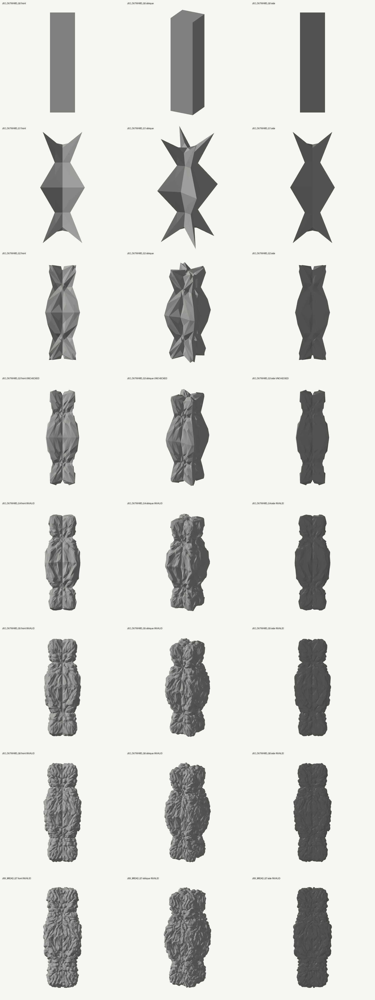
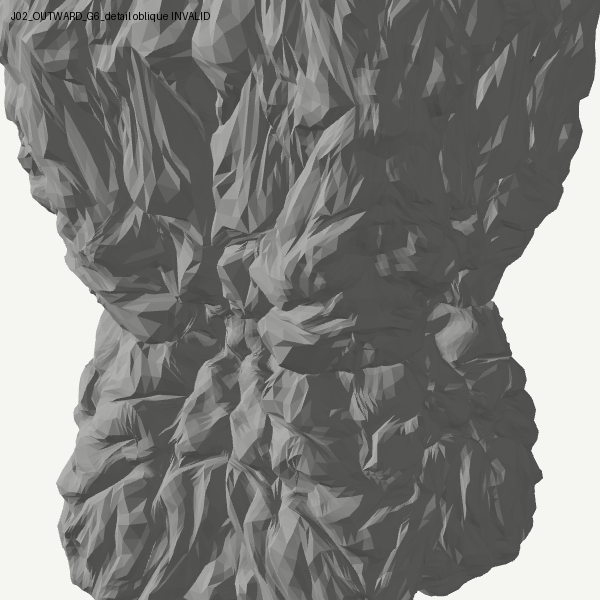
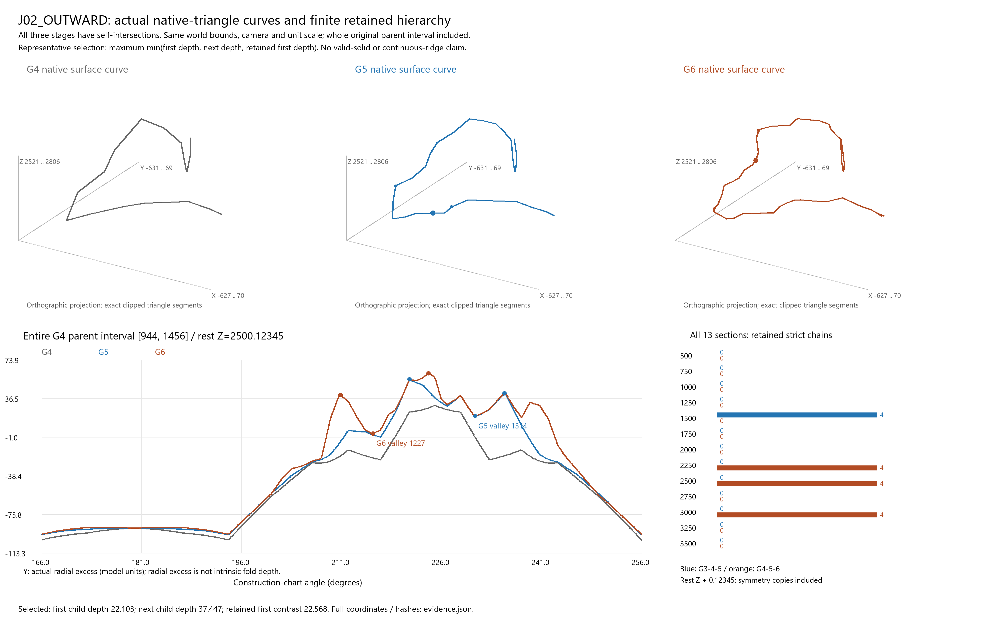
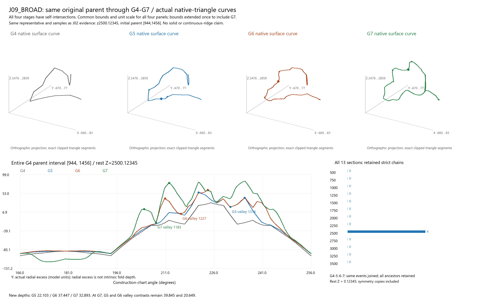
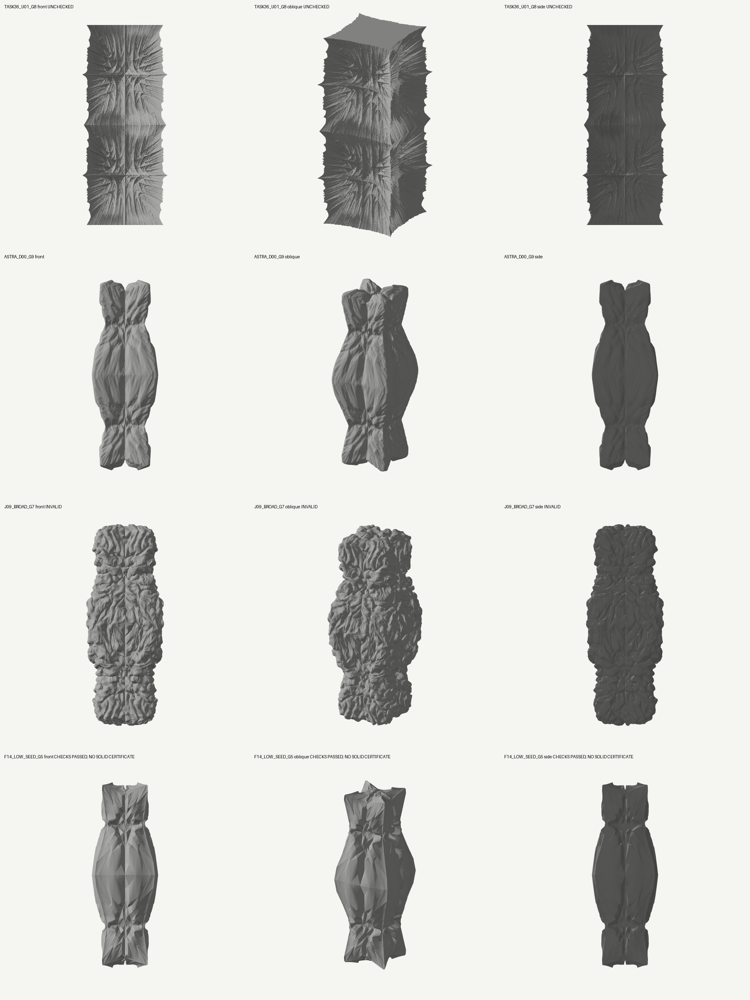
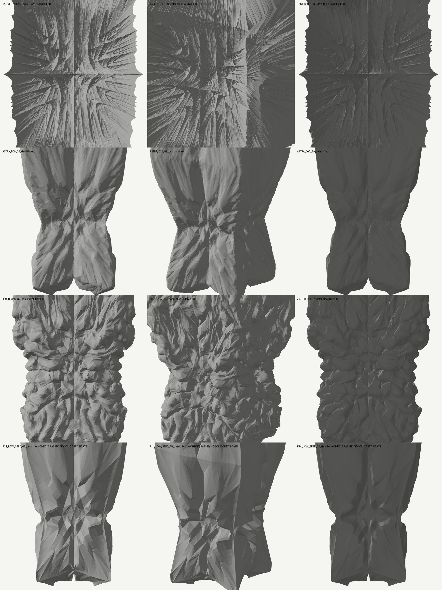
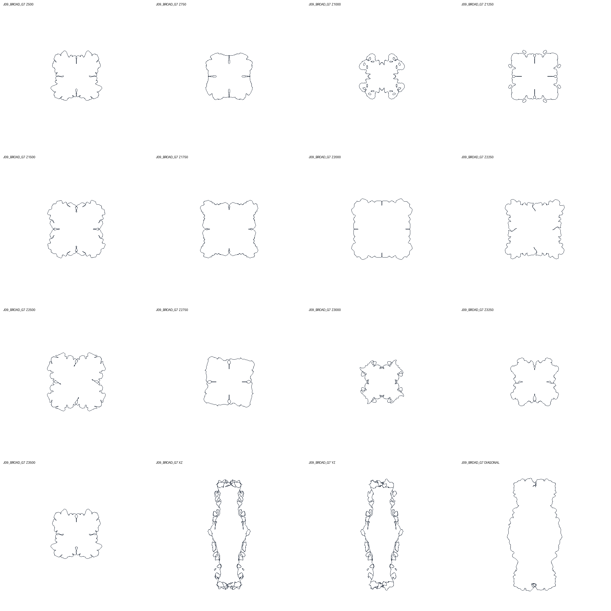

# Generative Freedom 연구 결과

**새 능력은 확인했지만 전체 조형 목표는 PARTIAL이다.** 여러 셀을 가로지르는 회전 영역을 현재 형상에서 다시 선택하는 연산으로, 큰 돌출부 내부의 새 골이 다음 골의 기반이 되는 사례를 확보했다. 전체 모습은 여전히 세로 능선·거친 표면이 강하며, 가장 유망한 후보는 자기교차가 있다. 이를 유효한 솔리드나 Hansmeyer 시스템의 재현으로 발표하지 않는다.

기준 `0c4ec452518415d2fb12f724553e25d732c4c7c2`, 별도 브랜치 `experiment/astra-generative-freedom`. 기존 Astra와 원본 CHESHIRE 코드·실험을 덮어쓰지 않았다. 새 자료는 `E:/CHESHIRE_DATA/astra_freedom/`. 구현·실행 방법은 [FREEDOM_IMPLEMENTATION.md](FREEDOM_IMPLEMENTATION.md), 원시 실행 인덱스는 [studies/freedom](../studies/freedom/README.md)를 따른다.

## 실제로 새로 생긴 형상

J02는 복구된 B00의 큰 몸통·목·끝단(G3)을 출발점으로 삼았다. 큰 능선 주변의 여러 면을 함께 회전시키고 다음 세대에서 실제로 생긴 hinge와 방향을 다시 읽었다. G4–G6에서 판의 가장자리가 두꺼운 돌출부와 굽은 골로 변하며, 그 내부에 더 작은 골이 추가된다. 초기 G0는 폭·깊이1000, 높이4000의 직선 정사각기둥이다. Z가 수직축이고 단위는 연구 단위다. 새로 만든 장식 profile이나 렌더별 스케일 보정은 없다.

G4–G6의 유한 표면 추적에서 첫 골이 유지되는 child–grandchild 연결16건을 확인했다. 예: rest Z2500.12345의 원래 부모 envelope는130.093→150.296→155.923, 첫 골22.103, 다음 골37.447, 마지막 단계의 첫 골 대비22.568이다. 숫자는 실제 삼각 표면 좌표의 radial excess 대비이며 내재적인 최단거리 깊이가 아니다. 대칭 사본도 개수에 포함한다.

J09는 G6 뒤에 반경을 다시320으로 넓힌 G7이다. 동일한 G4 부모 내부에서 첫 골→둘째 골→셋째 골이 이어지는4세대 연결4건을 확보했다. 모두 rest Z2500.12345의 대칭 사례다. 첫/둘째/셋째 발생 대비는22.103/37.447/32.893이며 G7에서도 앞선 두 골의 대비39.845/20.649가 남는다. 유한 단면 한 높이의 성과를 전체 기둥의 지속적인 계층으로 확대하지 않는다. 전체 기록은 `hierarchy/DOMAINS_FOLLOWUP_STRICT_V1/four_generation_linkage.json`.

## 무엇이 효과가 있었는가

| 대조 | 확인한 결과 | 해석 범위 |
|---|---|---|
| 서로 겹치는 접힘 제안의 단순 평균→간격을 둔 대표 영역·집중 가중치 | 같은 G3/G4에서 평균 상쇄율의 중앙값이 J01 .816, 간격만 바꾼 J04 .946, 가중치만 바꾼 J05 .896, 둘을 결합한 J00 .987 | 상쇄 감소는 실제 벡터로 확인. 이것만으로 미적 성공을 뜻하지 않음 |
| 같은 연산의 안쪽/바깥쪽 회전 | J00/J02의 G4–G6 새 골16/20/28 대16/44/48; 유지된3세대 연결0 대16 | 이 입력·레시피에서 바깥쪽 회전이 더 유망. 모든 형상에 대한 일반 법칙 아님 |
| 현재 형상/원래 rest 형상의 hinge로 seed 선택 | J02는 유지 연결16, J06은0 | rest 대조도 축·geodesic 거리는 현재 형상에 반응. 모든 feedback을 제거한 대조가 아님 |
| G7 반경150/220+반대 회전/320 | 새3세대 연결은 있으나 앞선 동일 두 골을 이어4세대가 되는 것은 넓은 반경 J09의4건 | 단순히 새 골 총수를 세면 지속성을 잘못 평가할 수 있음 |
| G5에서 회전축만 transverse로 전환(J10) | 새 골과 분기 위치가 달라지나 큰 부모 envelope 약화·날개 같은 날카로운 판 증가 | 방향 전환은 실제 작동하지만 이번 조건의 전체 조형 개선으로 선택하지 않음 |
| 비단조 field, 부모 거리/셀 거리 | F05/F06/F07의 유지 연결16/16/0; F04는84지만 부모 envelope 약화가 큼 | 부모 거리 사용이 국소 축소를 완화. 가장 큰 수치가 가장 좋은 전체 형상은 아님 |

F14 G5는 횡단 교차·embedding 검사를 통과하며11/13단면에서64개의 새로운 유한 basin을 보였다. F11 G5는6/13에서32개다. 둘 다 다음 규모까지 이어지는 유지 연결은0이다. F11/F14는 scalar 관측뿐 아니라 coherent normal 방향도 current/seed에 따라 바뀌므로 순수 scalar feedback 대조가 아니다. F14의 결과는 현재 형상 재독해가 모든 계열에서 자동으로 우월하다는 설명을 반박한다.

## 실패한 방향과 새로 드러난 제약

- 변위만 크게 한 field는 거친 파편과 교차를 늘렸다. heat 결과는 특징·방향 계산에만 쓰였으며 표면 XYZ를 smoothing으로 교체하지 않았다. 그럼에도 후속 반응 자체가 큰 깊이를 약화시킬 수 있었다.
- parent-scale pocket은 실제 적용 이동량을 회복했다. G6 삽입 cap의 입력 면 법선방향 이동량 |d| 중앙값은 memory0/.5/.8에서26.84→110.52→215.46이다. 이는 단면 골 깊이가 아니다. 그러나 cap 내부의 연속적인 새 주름보다 rim의 반복 사각 층·겹침이 발달했다. ancestry 저장과 cap 내부의 기하 발생은 별개다.
- exact fan은 선언된 native 삼각 표면을 그대로 세분화하고 G2→G3의 적격 world-plane3단면도 약1e-12 이내로 보존했지만 후속 형상은 계단·직사각 패널로 굳었다. 모든 기존 정점을 누적 보존하는 자체 제약도 있다. smoothing 제거 하나가 해결책은 아니었다.
- weighted CC 대 exact fan에서 부모 깊이가 줄어드는 위치와 커지는 위치가 모두 있었다. 기존 signed weight를 포함한 전체 배치의 차이이며 표준 CC 평균항 하나의 인과 실험은 아니다.
- 좁아지는 patch 반경만 반복하거나 넓은 반경만 반복하는 것으로 지속 계층을 보장하지 못했다. 영역 크기·회전 부호·선택이 상호작용한다. 아직 자동적인 feature-scale 선택이나 개별 능선의 내재적 성장 상태는 없다.

pocket4후보는 G4 이후 사전 지정 world-plane7단면 모두 다중 radial 교차로 child-valley 검사가 부적격이었다. 이는 새 골0이라는 뜻이 아니다. cap/rim 계보는 면의 후손 관계이며 공간적인 내부 포함을 인증하지 않는다. exact fan의 실제 표면 보존도 rest chart의 불변성을 뜻하지 않는다. 모든 G2–G7은 INVALID이며 교차128은 검사 cap에 도달한 하한이다.

기존 규칙·MOLA/weighted CC·native 자료와 검사기는 재사용했다. 새 핵심은 자체 구현한 geodesic 영역 회전과 겹침 처리다. 기존 알고리즘을 교체하거나 테스트 기준을 낮추지 않았다. 총 면 수 증가만으로 성과를 선언하지 않는다.

## Task36·이전 Astra와 비교

모두 width5000, target(0,0,2000), 동일 정면·사선·정확한 측면, flat shading이다. 세대·면 수·연산비용은 같지 않아 동일 비용 순위 비교가 아니다. 과거 기준은 새로 생성하거나 수정하지 않았다. 그림의 UNCHECKED는 이 렌더 도구에서 재검사하지 않았다는 표시이며 과거 검증을 취소한다는 뜻이 아니다.

이전 D00의 거시 형상 유지에 비해 J02/J09는 내부의 유한 골→골 계층 근거가 늘었다. Task36의 더 고른 미세 장식과 비교하면 이번 결과는 거칠고 불규칙하며, 넓은 분포·조형적 통합·교차 없는 얇은 골에서는 우월하다고 할 수 없다. 입력이 단순해서 불가능하다는 결론은 내리지 않는다.

`deliverables/D02_G7/`에는 가장 오래 같은 골의 계층을 유지한 **J09 G7**과 축소 반경 대조 J07 G7을 추가 보존했다. 각각655,360삼각형이며 교차1024 cap에 도달한 INVALID OBJ다. 16개 실제 단면·고정 렌더·native·정확한 OBJ roundtrip이 포함된다.

## 검증과 보존

- 전체 테스트 **1057 passed** (73.34초, 기존1024+신규33). 기존 테스트 수정0. `verification/full_suite_v1/pytest.log`.
- J02·F14·J09 재실행의 native·operator·중간상태31 NPZ가 SHA256까지 정확 일치. `verification/replay_comparison.json`. pocket 대조4개도 G1–G7 상태 배열 정확 재현. 같은 환경에서의 결과이며 플랫폼 간 bitwise 보장이 아니다.
- `deliverables/D01B_CORE/`: F11/F14 G5는 검사 범위 내 통과 OBJ, J00/J02 G6는 `_INVALID.obj`. 모두 .17g 좌표·면 exact roundtrip. J02/J00 교차1024는 cap에 걸린 하한이다. 새 대칭 제약은 강제하지 않았고 J02 X반사 최근접 오차81.11을 기록했다.
- 실제 world-plane 횡단13개와 종단3개는 원시 segment·triangle ID와 그림으로 보존했다. 도표 축을 후보마다 조정하지 않았다. 복잡한 단면의2D 전구간 교차 검사는 실행하지 않았으며 별도3D 횡단 검사를 적용했다.
- 13높이×2048방향, prominence15의 기존 기준을 유지했다. 이전 구간에 이미 존재한 골은 strict NEW에서 제외했다. 이 검사는 유한 construction chart 추적이지 연속 능선·내재 깊이·솔리드 인증이 아니다. 실제 world-plane 절단과 구분한다.
- 공면 overlap·접선·경계만의 접촉은 횡단 검사 제외다. 검사 통과를 제조 적합성으로 해석하지 않는다. 숫자가 유한한 invalid 실험은 중단·은폐하지 않았다.
- `H02_POCKET_SMALL`은 실행 중 소스 변경 감지로 완료 처리되지 않았다. H02_REPLAY는 정상 완료했고7 NPZ의 배열이 같았다. 초기 수치 경계 테스트 실패, export 준비 경로 오류, 중단된 고비용 전체 단면 분석도 원시 기록을 남겼다.

## G8 후속과 최종 선택

두 경로 모두2,621,440삼각형까지 진행했다. 반경을110으로 줄인 J11은 G7→G8 strict NEW28개(4/13높이), J09 뒤 반경220을 적용한 J12는43개(6/13높이)다. 그러나 동일한 기존 골을 잇는5세대 계층은 모두0이다. J12에서 기존 세 골의 대비는33.680/12.590/25.966이 되어, 둘째 골이 기준15 아래로 약해졌다. 새 골 총수가 늘어도 같은 계층의 지속성을 잃은 경우다. 기준을 낮춰 성공으로 바꾸지 않았다.

따라서 **J09 G7을 대표 결과로 선택**한다. J11/J12도 native·PRE·상태·레시피·실패 측정·정면/측면/사선 렌더를 모두 보존했다. `hierarchy/G8_STRICT_J11_V1/`, `hierarchy/G8_STRICT_J12_V1/five_generation_tracks.json`에서 같은 원래 부모의 추적을 확인할 수 있다. G8 두 실행은 각각211.3/173.7초, 관측 최고 process tree+driver4.27/4.21GB였고 RAM 가드를 유지했다. 모든 G8 후보는 교차가 있는 INVALID다. 무한 지속 계층이나 전체 조형의 완성을 입증한 결과가 아니다.

## 다음 연구 판단

이제 유효한 좁은 변위 범위에 머무르기보다 **같은 골의 지속성을 유지하면서 어느 넓이의 면들을 함께 움직일지**가 핵심이다. 다음에는 J09에서 확인한 부모 구간과 접힘 방향을 실제 surface patch로 운반하고, 그 내부에 새 회전 영역을 선택하는 방식이 우선이다. 단순 세대별 radius 목록을 자동 feature 관계로 대체할 근거를 이번 상태 배열에서 확보할 수 있다. 교차 수리·다른 표현으로의 변환은 이 형상 논리가 더 넓은 구간에서 반복된 뒤 별도로 비교해야 한다.

참고 이미지에서 읽은 것은 큰 돌출부의 재변형·깊은 골 주변의 다른 방향·다중 규모의 조직이다. 비공개 수식을 복원했다는 주장은 없다. 공식 [Subdivided Columns](https://michael-hansmeyer.com/subdivided-columns.html), [Digital Grotesque I](https://michael-hansmeyer.com/digital-grotesque-I.html), [II](https://michael-hansmeyer.com/digital-grotesque-II.html)를 다시 관찰했으며 기존 [문헌 조사](ASTRA_PRIMARY_METHODS.md)를 재사용했다. 공식 사진은 로컬 참고 폴더에만 두고 재배포 라이선스를 가정하지 않았다.
