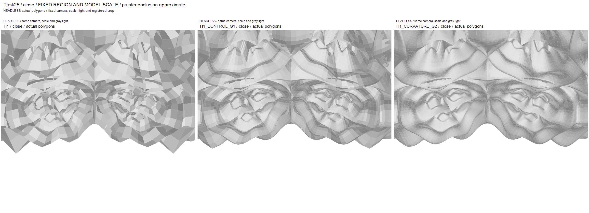
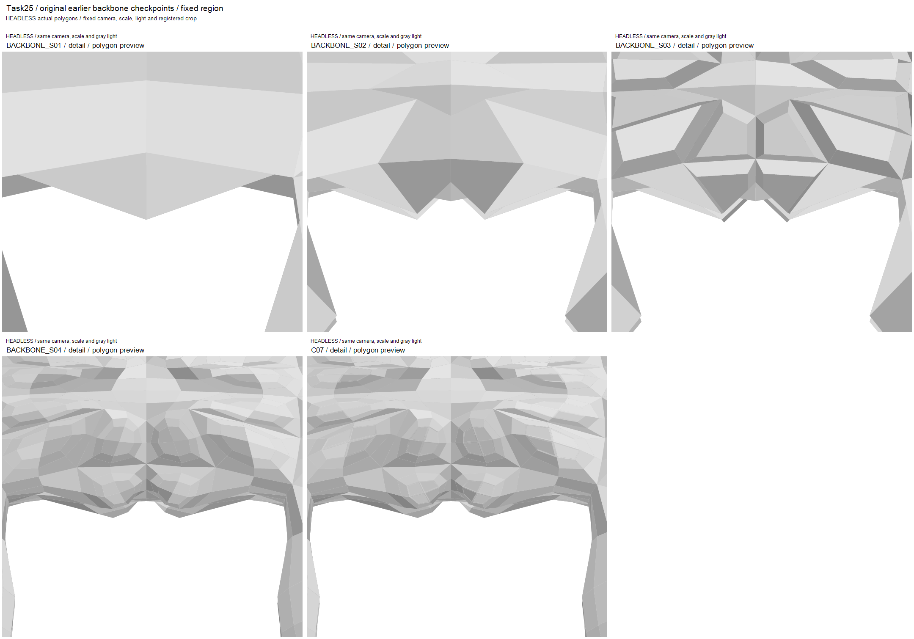
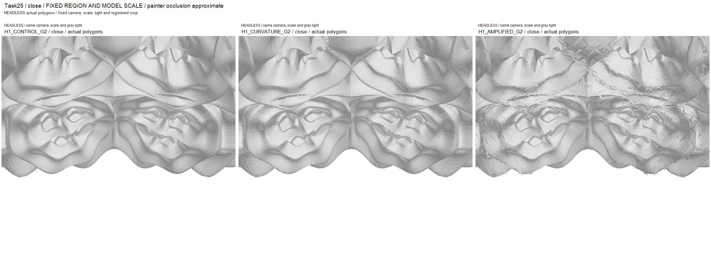
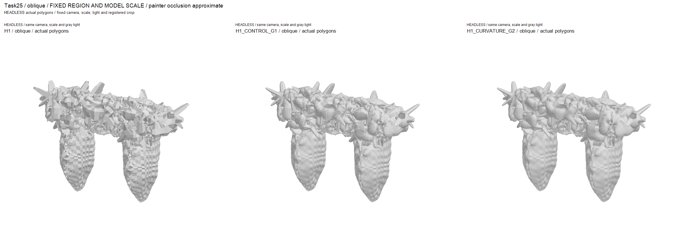
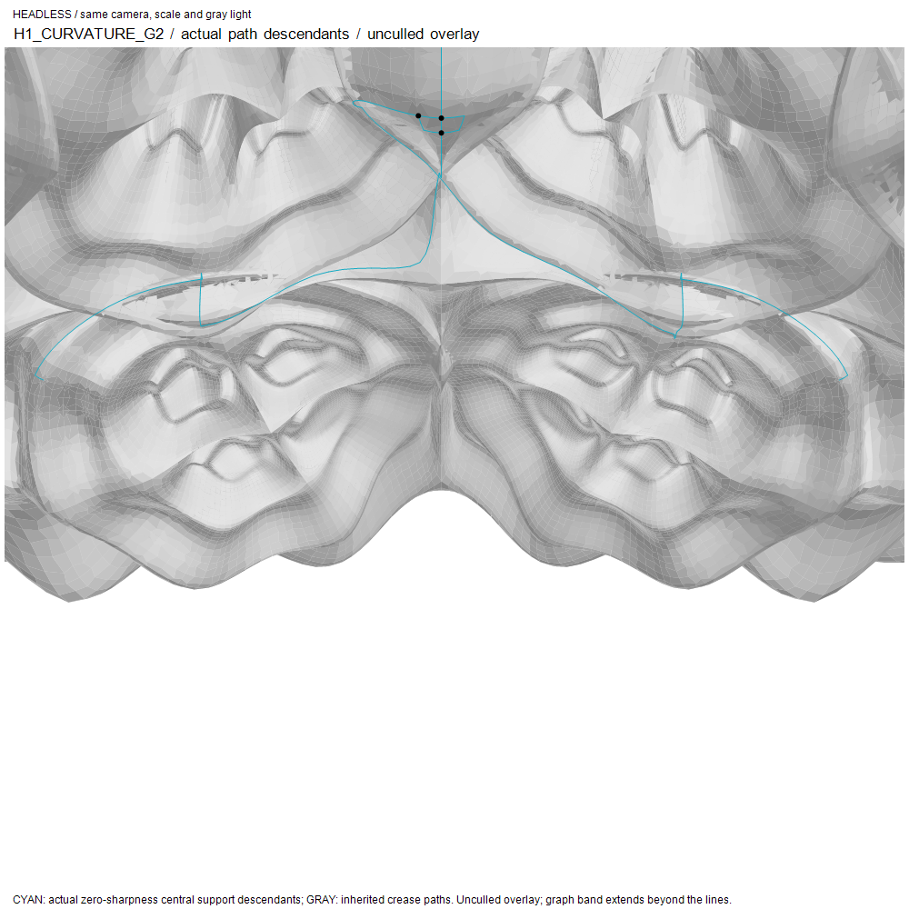

# Task25 — Generational folding / lintel convergence

**결과: 디자인 PROGRESS / PARTIAL.** 권장 다음 세대는
**H1_CURVATURE_G2**, 전체 **1,169,792 faces**다. 첫 대조군에서 다시 시작해
중앙의 실제 경로와 이전 세대 점 관계를 따르며, 법선 오프셋을 제거했다.
큰 말림과 안쪽 홈의 읽기를 보존하면서 국부 곡률이 바뀐다. 강한 새 돌출을
만들던 안들보다 읽기 좋지만, 대조군을 크게 넘어서는 작은 접힘의 계층은
아직 약하다. Digital Grotesque 수준의 전체 분기·다층 공간을 달성했다고
선언하지 않는다.

기술 실행은 두 추가 whole-gate 세대와 실제 파일 검증까지 완료했다.
**DCC 파일 준비 PASS:** full-resolution native 파일 재읽기·headless open을
통과했다. **자동 clay 캡처 미완:** 폴리곤 비교의 가림 한계가 남는다.

Task24 기준은 `385ec86c1f18ee1e2e0d61e2b32c524ceccfb683`이다. 원본 H1,
H2_R1, H3_R3와 Task23/24 branch를 보존하고
`experiment/task25-generational-folding`에서 작업했다. 큰 결과 루트는
`E:\CHESHIRE_DATA\task25`다. 최종 commit과 실제 파일 경로·크기·해시는
`source_revision.json`, `deliverables.json`에 별도로 기록한다.

## 네 갈래 말림의 경로

[SOURCE_MAP.md](../studies/task25/SOURCE_MAP.md)와 외부
`analysis/ancestry_map.json`에 실제 체크포인트 해시, face IDs, 영역 규칙과
C0/event 연관을 저장했다. 사용자 원본 두 장도 수정 없이 보존했다.
사진의 조직과 실제 H1 중앙부의 대응을 확인했고, 사용자가 연 파일의 정확한
해시나 카메라를 사진만으로 인증했다고 주장하지 않는다.

초기 두 modified CC에서 쌍을 이루는 조직이 보이고, 선택 Taper 뒤의
standard CC에서 네 갈래 조직이 명확해진다. C07에는 이미 상·하 크기가 다른
말림이 존재한다. H1 S01과 S03 Fold가 중심의 능선·곡선 관계를 강화하며,
마지막 Frame/Taper 네 단계가 최초 발생원이라는 증거는 없다. 실제 조상에는
C0 상인방 전면/후면/아랫면(14/15/16)과 초기 Taper event가 함께 나타난다.
양의 ancestry는 construction association이며 완전한 signed 영향계수는 아니다.

C07은 실제로 CC 세 단계와 Mola 두 event를 거친 입력이다. `backbone.json`에
나열된 후속 단계를 모두 실행된 것으로 세지 않았다. 원래 좌표와 Z-up을
보존했고 물리 단위는 여전히 미확정/None이다. 새 ALICE export, motif 복제,
사후 mirror, sculpting, remesh나 intersection repair를 사용하지 않았다.

## 실제 비교와 수정

모든 안은 전체 게이트 메시다. H1을 global split한 G1은 292,450 vertices /
292,448 faces, G2는 1,169,794 / 1,169,792다. 같은 H1 depth의 oriented
connectivity가 같으며 좌표와 적용 위치만 바뀐다. CONTROL은 추가 fold terms가
0인 **inherited-crease CC**다. Standard CC가 형상을 부드럽게 바꾸고 기존
네트워크 sharpness가 남으므로, 불변 tessellation이나 완전한 uncreased
standard CC로 부르지 않는다.

| 안 | 질문과 실제 변경 | 비교에서 드러난 점 |
|---|---|---|
| CONTROL_G1/G2 | 모든 추가 배치 항 0; 기존 crease 유지 | 큰 말림과 안쪽 홈이 더 부드럽게 읽힌다. 새로운 fold rule의 증거는 아니다. |
| FLOW_G1 | 기존 네트워크, band 18, wf/we/wp=24/-12/18, w1/w2=-.6/-1.1 | mantle은 변하지만 중앙은 대조군과 거의 같다. 기존 경로의 support가 중앙을 충분히 덮지 못한다. |
| REVISED_G1 | sharpness=2, band 28, 36/-18/24, -1.1/-1.7 | 국부 굴곡보다 작은 가시와 각진 잡음이 증가한다. |
| CONVERGENCE_G1 | 실제 N6 중앙 support 추가; sharpness=0; band 16, 18/-14/12, -.85/-1.3 | 중앙에 실제 작용하지만 큰 법선 오프셋이 가시·표면 요철을 만든다. |
| CONVERGENCE_G2 | 위 noisy G1을 재개; band 32, offsets 0, w3/w4=-.6/.35 | 두 번째 세대에서도 기존 요철이 남는다. |
| RENEWED_G2 | CONTROL_G1에서 새 중앙 경로; band 32, 1.8/-1.2/1.2, -.18/-.3, w3/w4=-.9/.5 | 큰 조직을 유지하나 가까이서 격자 모양 요철이 보인다. |
| CURVATURE_G2 | RENEWED와 같은 입력·경로·가중치, **wf/we/wp만 모두 0** | 격자형 요철이 크게 줄고 큰 말림·홈이 다시 읽힌다. 대조군과의 차이는 국부적이며 새 계층은 약하다. 권장 경로. |
| AMPLIFIED_G2 | CURVATURE와 같은 조건에서 **w3/w4만 -3/1.5** | 더 강한 child-face 외삽이 각진 작은 면과 겹침을 증가시킨다. 부드러운 안쪽 반복보다 결정형 조각이 우세해 권장 안으로 교체하지 않았다. |

여기서 wf/we/wp는 원래 모델 단위의 절대 거리이고 w1/w2/w3/w4는
무차원이다. Task24의 130-unit 오프셋을 작은 자식 face에 반복하지 않았다.
새 route는 normalized xz 중심 (0,.71), 상부 targets=(±.13,.82), 하부
(±.1,.63), target_y_ratio=-1.1을 따라 기존 router가 실제 mesh edge를 찾는다.
전체 resolved 선언은 `recipes/*.json`, `request.json`, `operator.json.gz`다.
모든 seed는 None이고 임의 random shape를 추가하지 않았다.

CURVATURE의 Eq4 V/F/E1/E2 계수는 .0375/.7125/.125/.125,
AMPLIFIED는 -1.25/2.5/-.125/-.125다. 모두 합은 1이며 signed geometric
placement와 positive semantic association은 별개다. 강화 실험은 큰 자식
접힘을 만들 수 있는지 확인했지만, 이 조직에서는 작은 면의 angularity가
증가했다. 더 세게 설정하거나 더 많은 face를 만드는 것만으로 해결되지 않는다.
CURVATURE와 같은-depth 대조군의 실제 좌표 비교에서는 78,025 vertices가
1e-10보다 많이 바뀌었고, nonzero displacement median=.0877, 95th percentile=8.6727,
max=43.5352 original units였다. 변화량은 새 hierarchy의 품질 증명이 아니다.

기존 H1 crease는 sharpness 10에서 G1 사용 후 9, G2 사용 후 8로 감소한다.
REVISED/H2/H3의 명시적 override 2는 첫 split 뒤 1이다. 중앙 support는 0이며
새 crease lock이 아니다. placement support만 중앙으로 제한하고 기존 네
네트워크는 reference crease 제약으로 유지한다. 활성 band는 graph-hop의
선형 alpha이고 face/edge는 실제 parent vertices의 alpha 평균을 쓴다.
권장 G2에서 input support는 19,146 vertices, 실제 추가 배치 활성 수는
face/edge/corner=19,856/39,023/19,146이다. Eq4 eligible active faces는
19,856, fallback은 0이다. 중앙의 175 실제 root edges는 split 뒤 350
descendants가 된다. 새 경로 generation=1, 네 inherited networks는 generation=4다.
실제 current IDs와 roots/C0 연관, band 설명은 `analysis/folding_support.json`에
있으며 cyan 경로 overlay는 visibility culling 없이 그렸다고 명시한다.

H2_R1과 H3_R3도 각자의 실제 입력에서 전체 첫 세대를 생성하고 동일한
whole/underside/detail/second-angle/wire 품질로 검토했다. H2는 별 모양 canopy와
통과부가 읽히지만 작은 spike/cap 중심의 가지 조직이 약하고, H3는 큰 판의
가림이 중앙과 passage를 계속 지배한다. 둘의 중앙 네 말림은 C07 공통 조상이며
서로 독립적인 발생 메커니즘으로 세지 않았다. H1의 다음 세대 비교를 더
깊게 진행할 근거가 있어 H1 계열을 유지했다.

## 구현과 재개 상태

실제 integration 문제는 기존 네트워크가 Mola 후 살아남은 원래 edge 조각만
추적해 중앙을 충분히 덮지 않는 점이었다. 일반 Mola ridge/valley 분류기를
만드는 대신 기존 N6의 실제 경로를 좁은 placement support로 연결했다.
`support_network_ids`는 배치 범위를 선택하며 reference crease 제약과 분리된다.

기존 Eq4는 실제 이전 CC의 V/F/E origins가 있을 때만 사용하도록 fold API에
연결했다. Task24 말단의 generic origins는 없었으므로 첫 실제 split에서
구조적 corner/edge/face correspondence로 bootstrap한다. 위치 근사 매칭은 없다.
Absolute CC는 5→6→7, continuation depth는 0→1→2이고 network generation은
route birth 이후의 split 수다. OBJ alone으로 재개하지 않는다.

`geometry.json.gz`와 `CHESHIRE_CC_CONTINUATION_V1` 상태는 keyed geometry,
전체 face/event history와 roles, positive C0 association, branch signatures,
anchors, network roots/parents/sharpness, 모든 point origins와 generation을
보존한다. 동일한 face record를 lossless interning하여 반복 저장만 줄인다.
완료 선언과 next_step=None도 저장한다. 미예약 next step이며 state 삭제가 아니다.

메모리 때문에 기존 crease/sharp/smooth 세 Mesh 동시 보관을 없앤 선택적
`POINTWISE_EXISTING_STENCILS` 경로를 추가했다. 기존 COMPAS crease topology,
이전 전체 메시 이웃과 기존 Eq4/10/11 및 가중 공식을 그대로 사용한다.
chunk/stitch, 새 topology engine, semantic 데이터 손실이나 out-of-core system은 없다.
기본 실행 경로와 Task24 동작은 유지했다. 감사 기록은 checksum과 bounded
sample이고, 실제 input/output/recipe와 complete continuation state는 별도로 남긴다.

소형 비대칭 tri/quad cage의 같은 topology/수치 검증과 재개 테스트를 수행했다.
실제 전체 H1 FLOW의 3-mesh/pointwise 비교도 IDs와 oriented connectivity가
정확히 같으며 최대 좌표차는 1.1368683772161603e-13이다. 반올림 차이가 있으므로
bitwise 동일하다고 부르지 않는다. 저장/재읽기 후 다음 fold는 uninterrupted
실행과 geometry·state·sharpness decay가 정확히 같다.

## 실측과 중단

| 완료된 whole-gate 안 | Faces | Fold 계산 s | Driver/worker 총 s | 관측 peak GiB |
|---|---:|---:|---:|---:|
| CONTROL_G1 | 292,448 | 31.58 | 60.03 | 1.15 |
| FLOW_G1, 기존 3-mesh | 292,448 | 121.44 | 171.73 | 2.67 |
| REVISED_G1, 기존 3-mesh | 292,448 | 121.93 | 171.79 | 2.66 |
| FLOW_EFFICIENT_G1 | 292,448 | 47.83 | 76.04 | 1.11 |
| CONVERGENCE_G1 | 292,448 | 42.84 | 76.44 | 1.12 |
| H2_R1_SCOUT_G1 | 292,864 | 42.76 | 69.52 | 1.12 |
| H3_R3_SCOUT_G1 | 290,448 | 42.37 | 69.95 | 1.12 |
| CONTROL_G2 attempt_002 | 1,169,792 | 129.91 | 250.62 | 4.03 |
| CONVERGENCE_G2 | 1,169,792 | 195.36 | 308.30 | 4.05 |
| RENEWED_G2 | 1,169,792 | 171.03 | 298.53 | 4.07 |
| CURVATURE_G2 | 1,169,792 | 171.08 | 295.27 | 4.04 |
| AMPLIFIED_G2 | 1,169,792 | 169.67 | 296.62 | 4.04 |

Peak은 기존 guard의 sampled generator process-tree + driver 측정이다.
GUI/DCC render RAM을 이 값으로 주장하지 않는다. 세부 operation/metadata/
state/OBJ export/reread 시간, 당시 available RAM, live guard, 각 파일 byte size와
hash는 `analysis/measurements.json`, 각 시도 summary와 process.json에 있다.

처음 16,000 bytes/output-face 예측은 1.17M에서 18.717GB를 요구해
FLOW_G2_UNCALIBRATED를 **할당 전 예측 중단**했다. 실제 one-topology whole-gate
다섯 실행의 최대 4208.4 bytes/face에 35% 여유를 둔 5700으로 보정했다.
CONTROL_G2 attempt_001도 total peak를 already-loaded input이 차감된 remaining
available과 비교해 중단했다. 이미 로드된 worker resident를 total 예측에서
빼서 **추가 할당**을 남은 RAM과 비교하도록 회계를 수정했고 위험한 증가가
계속 중단되는 테스트를 추가했다. Driver는 예측에 보수적으로 남겼다.
계수나 live guard를 제거하여 목표 face 수를 강제하지 않았다.

G2 total 예측은 6,667,814,400 bytes였고 실제 peak 약 4.33–4.37GB였다.
55% remaining available의 추가 할당 제한, live process-tree limit=65% initial
available(최대 12GiB), 2GiB available floor를 유지한다. Runtime/contact/envelope/
역사적 face cap으로 중단하지 않았다. 안전하지 않은 4.68M은 할당하지 않았다.
동일 계수의 total 예측 약 26.67GB는 현재 잔여 RAM보다 크다. 관측 OOM이 아니다.

## 파일 검증과 시각 증거

전체 프로젝트 gate는 **798 passed, zero skips**다. 모든 성공한 실제 OBJ를
streaming reread하여 XYZ와 oriented polygon cycle을 정확히 비교했다.
몰래 weld, triangulation이나 repair하지 않았다. 모든 H1 G2의 V-E+F=2이며
closed/manifold connectivity는 확인했지만, self-intersection 없는 물리 부피나
새 topological handle이 생겼다는 뜻은 아니다. 어두운 픽셀은 cavity 관찰로 남긴다.

권장 OBJ는 **130,763,487 bytes (124.71MiB)**,
`meshes/H1_CURVATURE_G2.obj`, native는 **67,749,447 bytes (64.61MiB)**,
`dcc/H1_CURVATURE_G2.3dm`이다. 실제 File3dm.Read에서 모든 double XYZ와
oriented tri/quad records를 비교했고 RhinoDoc.OpenHeadless의 one object를
확인했다. Display normals만 계산했다. Native read/write/sections/document
처리는 cold startup 제외 18.51s, native host peak working set은
950,116,352 bytes였다. Generator process-tree 측정과 별도 범위다.
실제 읽은 원본/lead 파일을 X=-392, Y=-350, Z=2450에서 절단한 polylines와
동일 좌표 frame의 `analysis/native_sections.svg`를 저장했다. 단면의 수나
겹친 선을 새 topological porosity로 해석하지 않는다.

이미지는 모두 actual polygons 또는 unculled wire다. 기존 System.Drawing
painter의 flat normals와 근사 가림을 사용한다. Native라는 이름의 프리뷰를
DCC render로 혼동하지 않으며 생성 이미지나 display displacement가 없다.
사용자 원본은 더 좋은 clay 시각 증거지만 새 Task25 candidate의 렌더가 아니다.
전체/front/oblique/underside와 두 detail 각도, close/wire의 공통 카메라를 보존했다.

Rhino NoWindow detached viewport는 bitmap null, native preview는 doc 없이
실패하고 explicit headless doc에서도 SEHException이었다. 실패 source와
기록을 외부 `analysis/dcc_failure` 및 `rhino_display_failure.json`에 보존했다.
Task24의 hung hidden capture를 반복하지 않고, 기존 사용자 Rhino 문서를
조작하지 않았다. 자동 clay 캡처는 미완이며 actual native-file validation과
분리한다. 실제 native-file plane intersections는 별도 기하 선형 증거다.

재현·열기·상태 재개 절차는 [TASK25_HANDOFF.md](TASK25_HANDOFF.md)에 있다.
Review ZIP에는 작은 문서·source snapshots·정확한 recipes·실측·비교 이미지와
원본 사용자 참조를 넣고, full-resolution native/OBJ와 state는 별도 MODEL ZIP과
외부 파일로 제공한다. 최종 local commit 후 clean tree와 protected Task23/24
refs를 확인하며 push/merge/publish와 Task26은 실행하지 않는다.
